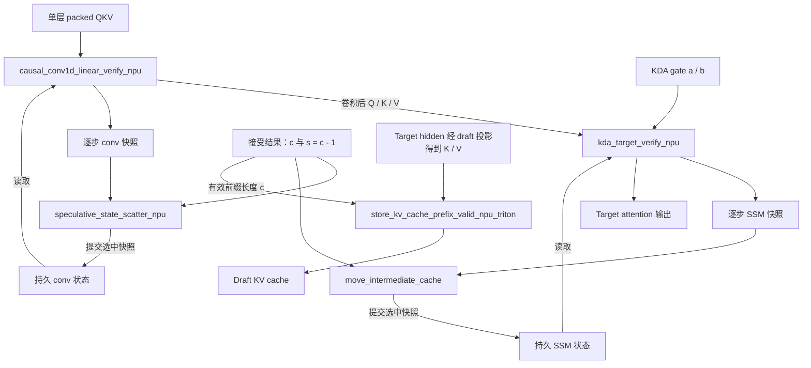

# DSpark 新增 Ascend NPU 算子设计

## 1 功能概述

本文描述 SGLang 为 Kimi K3 DSpark 推理新增的 Ascend NPU 算子，依据指定分支的实际实现说明接口、计算语义、数据布局、并行划分和集成约束。设计围绕两项需求展开：验证阶段生成每个候选位置对应的状态快照；接受边界确定后，只提交所选状态和有效 KV 前缀。

相对于比较基点，按新增可调用接口计，共有 **5 个 DSpark 主路径接口**和 **1 个同批引入的兼容回滚接口**；兼容接口在第 4.6 和 5.6 节单列，避免与 DSpark 的快照提交路径混淆。

| 接口 | 职责 | 在指定分支中的位置 |
| --- | --- | --- |
| `causal_conv1d_linear_verify_npu` | 固定宽度因果卷积，保存逐步卷积窗口 | KDA target verify |
| `kda_target_verify_npu` | KDA 状态递推与输出，保存逐步 SSM 状态 | KDA target verify |
| `speculative_state_scatter_npu` | 按请求、源槽和步号提交状态快照 | DSpark conv 状态提交 |
| `move_intermediate_cache` | 提交 SSM 快照，适配目标状态的实际 stride | DSpark SSM 状态提交 |
| `store_kv_cache_prefix_valid_npu_triton` | 根据设备侧长度写入有效 KV 前缀 | Target hidden 注入 draft KV 的 NPU 路径 |
| `conv_state_rollback` | 对旧布局卷积窗口执行原地移位 | 非 DSpark 快照路径的兼容接口 |

公共路径仅说明调用这些新增算子所需的适配接口。DSpark 通用候选生成、接受判定、调度、SPS/STS、CUDA 算子和普通 PyTorch fallback 不在本文范围内。已有外部 NPU 算子的调用也不计为本分支新增实现。

### 1.1 代码基线与来源

以 [hanwlax/sglang 的 0729_dspark](https://github.com/hanwlax/sglang/tree/f3dc7caf6168d581c0f5fcb36a37f331ac8a4872) 为代码基线，固定快照 `f3dc7caf6168d581c0f5fcb36a37f331ac8a4872`，比较基点为 `66034bff8bdf4613d02ddd270f19f5f29bd1e020`，核对日期为 2026-09-14。GitHub 分支头与本地 `mine/0729_dspark` 一致。

以 hanwlax 编写或提交的 DSpark/NPU 改动为主体；为解释分支实际行为，同时列出必要的协作修正，并标明作者和提交者。`userName` 为 Git 元数据原值，不推断其真实身份。启动脚本中的机器地址和调试配置不作为产品接口。

本文中的 SR 编号是本地需求追踪编号，DPR 从性能、资源、可靠性、兼容性和可验证性分析设计约束；它们不代表已分配的外部需求系统编号，也不表示相关验收已经通过。

| 设计主题 | Commit | 作者 | 提交者 | 归属说明 |
| --- | --- | --- | --- | --- |
| Conv/KDA verify、scatter、SSM move 与兼容 rollback | [7d0eb63aca](https://github.com/hanwlax/sglang/commit/7d0eb63aca9727db9836b31513bd5253c54421c2) | hanwlax | hanwlax | hanwlax 实现 |
| 固定 48 program 的 scatter 调整 | [a3890a3539](https://github.com/hanwlax/sglang/commit/a3890a3539d57e3c9e5fabe935e643ffdafd00a4) | zhang-chunli01 | zhang-chunli01 | 分支协作修正 |
| 设备侧有效 KV 前缀写入及缓存池接入 | [9fd3ce3542](https://github.com/hanwlax/sglang/commit/9fd3ce3542633386451b9068412759483277ed7e) | hanwlax | hanwlax | hanwlax 实现 |
| SSM 目标 stride、V 分块及布局用例 | [f0831b259d](https://github.com/hanwlax/sglang/commit/f0831b259dae710c178329779eacaed88efa4d57) | zhang-chunli01 | zhang-chunli01 | 分支协作修正 |

## 2 SR设计

| SR | 需求 | 设计约束 | 验收判据 |
| --- | --- | --- | --- |
| K-SR-01 | 批量完成因果卷积验证 | 固定宽度输入，逐步保存原始输入窗口，verify 不提交持久状态 | 输出及全部窗口与逐步参考一致 |
| K-SR-02 | 批量完成 KDA 状态递推 | 支持 GQA 和两种 gate 语义，逐步保存 SSM | 输出、头映射与全部 SSM 快照符合参考 |
| K-SR-03 | 按接受边界提交 conv/SSM | 统一使用 step=c-1，按真实目标 stride 写入 | 选中快照与持久状态一致，其他槽不变 |
| K-SR-04 | 仅写入 draft KV 的有效前缀 | 由设备长度做 mask，固定发射 shape | c=0/1/U 及混合接受长度均不污染无效位置 |
| K-SR-05 | 保证图重放与状态隔离 | 有效索引有界且无写冲突；遵守各算子的哨兵契约 | 多轮 replay 改变接受长度后与 eager 一致 |

非 DSpark 的旧卷积窗口回滚仅保留兼容性，不增加为主路径 SR。正索引上界检查和 tracking 接入缺口分别见第 6、7 章。

## 3 实现思路

### 3.1 维度与状态语义

| 符号 | 定义 |
| --- | --- |
| `B` | 本次调用的请求数，可包含图执行使用的 padding 请求 |
| `T` | 每请求固定验证宽度；DSpark target 输入通常为 `anchor + γ 个候选`，因此 `T = γ + 1` |
| `N = B × T` | KDA verify 的展平 token 数，顺序为 `token = request × T + step` |
| `L` | 本次状态提交覆盖的层数；verify 算子本身按单层调用 |
| `P / R` | 持久状态池 / 临时快照池的槽位容量，二者索引独立 |
| `C / W` | 卷积通道数 / 历史窗口长度，卷积核宽度为 `W + 1` |
| `Hq / Hk / Hv` | Q、K、V 头数 |
| `K / V` | KDA 的 key / value 维度；单头状态矩阵布局为 `[V, K]` |
| `c[r]` | 请求 `r` 本轮提交的前缀长度 |
| `s[r] = c[r] - 1` | 固定线性验证链的提交快照下标，从 0 开始 |
| `U` | KV 写入接口中的每请求源行宽度，由该次 `loc_2d` 决定 |

快照保存的是**处理完对应输入 token 后**的状态。例如 `T = 8、c = 3`，应提交下标 2，即处理完 anchor 和前两个候选后的状态。新采样的 bonus token 作为后续输入，不在本轮状态快照中；接受接口中的长度命名不能改变这一输入状态对应关系。

### 3.2 调用与数据流



验证阶段，DSpark 调用卷积算子时显式设置 `update_persistent_state=False`；KDA 算子只读取持久 SSM。两类持久状态都在接受结果产生后才由提交算子写入。KV 前缀算子处理已经投影、归一化和应用位置编码的 draft K/V，不承担这些计算。

提交的语义关系为：

```text
conv_persistent[:, dst[r], ...] = conv_snapshot[:, src[r], s[r], ...]
ssm_persistent[:, dst[r], ...]  = ssm_snapshot[:, src[r], s[r], ...]

for j in [0, c[r]):
    draft_kv[loc[r, j]] = source_kv[r * U + j]
```

上式是接口语义，不表示实现中存在 Python 逐请求循环。实际有效性判断在 device kernel 内完成。

## 4 实现设计

### 4.1 固定宽度因果卷积验证

#### 4.1.1 计算与快照语义

令初始历史 `h[0..W-1]` 按从旧到新排列。每个通道、每个验证步执行：

```text
z_t = bias + sum(weight[j] * h[j], j=0..W-1) + weight[W] * x_t
h   = concat(h[1:], x_t)
y_t = z_t                       # activation=None
      或 z_t / (1 + exp(-z_t))   # silu/swish
snapshot[slot, t, channel, :] = h
```

历史、权重、bias 和累加值加载后转为 FP32，输出写回时转换为输出 dtype。快照保存的是**原始输入形成的历史窗口**，不保存激活后的卷积输出。`update_persistent_state=True` 时，仅在全部步骤结束后将最终窗口写回持久状态；DSpark verify 不启用此行为。

`out` 以全零张量初始化。若持久槽或快照槽任一个为负，该请求整体被屏蔽：不读取历史、不写快照、不更新持久状态，输出保持零。正索引的容量上界由调用方保证。

#### 4.1.2 并行划分

每个 program 负责一个请求的一块通道，内部通过 `tl.static_range(T)` 顺序推进所有验证步骤：

```text
BLOCK_C = min(256, next_power_of_2(C))
grid    = (B, ceil(C / BLOCK_C))
```

这样同一通道的历史在一次 kernel 执行内连续更新，避免按 token 从主机重复发射卷积。源码注释记录了 8 步验证时，512 通道 tile 会使 Ascend 910 的 192 KiB UB 超出预算，因此实现采用最大 256 通道 tile，为编译器临时缓冲留出空间。这是当前代码的分块依据，不代表不同 NPU 或不同 `T` 下已经完成性能调优。

每层计算量为 `O(B × T × C × (W+1))`，快照写入量为 `B × T × C × W` 个元素。增加 `T` 会同时增加展开计算和快照开销。

### 4.2 KDA 固定宽度验证

#### 4.2.1 Gate 输入契约

算子区分两种输入语义，避免 K3 已激活的 gate 被重复激活：

| 模式 | 输入语义 | kernel 中的变换 |
| --- | --- | --- |
| `gates_are_preactivated=False` | `a`、`b` 为原始 gate 输入 | `g = exp(-exp(A_log) × softplus(a + dt_bias))`，`β = sigmoid(b)` |
| `gates_are_preactivated=True` | `a` 为 log-decay，`b` 为已激活的更新系数 | `g = exp(a)`，`β = b` |
| 参数为 `None` | 由形状推断 | `a`、`b` 同时含前导单例维时，选择已激活模式 |

原始 gate 模式的 softplus 使用阈值 20：输入大于阈值时直接取输入，否则计算 `log(1+exp(x))`。已激活模式即使不读取 `A_log`、`dt_bias` 的数值，包装接口仍要求传入同设备张量。

当前 NPU dispatcher 没有显式传递 `gates_are_preactivated`，因此实际依赖上述形状约定。NPU 算子不接收 `lower_bound`；模型若使用带下界的 gate 变换，必须在传入已激活 gate 前完成，不能把原始 gate 模式视为包含全部模型 gate 语义。

#### 4.2.2 状态递推

对一个请求、一个 value head，令 `S` 为 `[V,K]` 状态。每步先按以下方式归一化 Q/K：

```text
q_hat = q / (sqrt(sum(q * q)) + 1e-6) * scale
k_hat = k / (sqrt(sum(k * k)) + 1e-6)
scale = K**(-0.5)  # 默认值，也可显式传入正值
```

随后顺序执行衰减、预测残差、秩一更新与输出投影：

```text
S_decay = S_prev * g[None, :]
delta   = (v - sum(S_decay * k_hat[None, :], axis=K)) * beta
S_next  = S_decay + delta[:, None] * k_hat[None, :]
y       = sum(S_next * q_hat[None, :], axis=K)

snapshot[scratch_slot, step, head, :, :] = S_next
S_prev = S_next
```

FP32 状态在 program 内跨步保留，每步快照单独转换为缓存 dtype。因而与“每个 token 都把低精度状态落回内存后再读入”的逐 token 实现相比，舍入路径不同；数值验证应使用匹配的 FP32 递推参考并记录 dtype 对应的误差。

持久槽为负时以全零状态开始计算；快照槽为负时只跳过快照写入，仍计算输出。这与卷积算子“任一负槽即屏蔽整个请求”的行为不同。算子从不写回 `initial_state_source`。

#### 4.2.3 并行划分与支持边界

```text
BK   = next_power_of_2(K)                 # 要求 BK <= 256
BV   = min(64, next_power_of_2(V))
grid = (B, Hv, ceil(V / BV))

num_warps = 1
num_stages = 3
multibuffer = False
```

每个 program 处理一个请求、一个 value head 和一块 V 行，持有 `[BV,BK]` FP32 状态；K 维完整保留，以便在本 program 内完成归约。V 维拆分限制片上状态块的大小，T 维顺序展开保留递推依赖。

该接口只识别 `request × T + step` 的固定线性链，不接收 `cu_seqlens` 或树状父节点。`N % T == 0` 只是形状检查，不能证明 ragged 数据已经正确分组。公共 backend 虽含 dense/ragged 转换逻辑，当前 NPU dispatcher 未把序列边界传入该算子，不能据此宣称 NPU kernel 原生支持变长验证。

每层计算量为 `O(B × T × Hv × V × K)`，快照写入同阶。所有正槽位需要合法且在容量内；多个请求写同一个快照槽会发生竞争。

### 4.3 通用状态快照提交

#### 4.3.1 按 stride 寻址

源、目标的层、槽、step 和尾部 stride 均从实际张量读取，单位为元素。尾部不足三维时，在前面补大小为 1、stride 为 0 的维度，统一按三维坐标计算地址。

令标准化尾部为 `[d0,d1,d2]`，展平元素下标为 `e`，则：

```text
i0 = e // (d1 * d2)
i1 = (e % (d1 * d2)) // d2
i2 = e % d2

src_offset = layer * src_stride_L + src_slot * src_stride_R
           + step * src_stride_T + sum(ij * src_tail_stride_j)
dst_offset = layer * dst_stride_L + dst_slot * dst_stride_P
           + sum(ij * dst_tail_stride_j)
```

因此，源和目标可以具有不同的物理布局，只要逻辑 shape 一致且目标元素没有重叠。该接口无需先把状态转为连续副本。

#### 4.3.2 固定发射规模

设 `F = product(tail)`：

```text
BLOCK         = min(1024, next_power_of_2(F))
logical_tasks = B * L * ceil(F / BLOCK)
launch_grid   = (48,)

for task in range(program_id, logical_tasks, 48):
    解码 request、layer、tail_block
    加载三个索引并构造有效 mask
    读取快照，写入持久状态
```

实现将逻辑任务数与实际发射 grid 分开，避免直接把请求数、层数和尾部分块展开成较大的 launch grid。48 是该版本的固定配置，不根据设备规格自动推导。

有效请求仅拷贝一个所选快照，单次读写量为 `2 × B_valid × L × F` 个元素，不随 `T` 线性增长。索引筛选与拷贝融合在同一 kernel 中，提交路径无需用 `nonzero` 或 `index_select` 先生成动态长度列表。

### 4.4 SSM 专用快照拷贝

#### 4.4.1 并行划分与有效性

```text
grid    = (B,)
H_BLOCK = h_block_size   # 默认 1
BLOCK_V = 64
BLOCK_K = next_power_of_2(K)
```

一个 program 处理一个请求，内部遍历全部层，再按头块、V 块拷贝。片上 tile 为 `[H_BLOCK,64,BLOCK_K]`，沿 V 切块避免一次持有整张状态矩阵。`h_block_size` 没有包装层合法性检查，当前默认配置为 1；其他取值须单独验证编译和资源占用。

只有 `last_steps_tensor[r] < 0` 会提前返回。**负的源槽或目标槽不会被独立屏蔽**，所以有效 step 必须同时对应合法源槽、目标槽。这是它与通用 scatter 的另一项接口差异。包装层也没有空请求提前返回逻辑，调用方应跳过空调用，不将零 grid 的行为视为接口保证。

当前 Ascend backend 先调用该算子提交 SSM，再在 DSpark 快照模式下调用通用 scatter 提交 conv。两次调用使用同一组工作槽、源槽和接受步号。

### 4.5 KV 有效前缀写入

#### 4.5.1 分块与图执行

```text
K_ROW_DIM = Hk * Dk
V_ROW_DIM = Hv * Dv
BLOCK     = 128
grid      = (B*U, ceil(max(K_ROW_DIM, V_ROW_DIM) / BLOCK), 2)
```

三个 program 维度分别对应源行、行内元素块、K/V 分支。kernel 根据 `src_row // U` 读取设备侧提交长度，结合列号构造有效 mask；有效位置再读取 `loc`，并使用源、目标各自的行 stride 完成拷贝。

发射形状由固定源宽度和张量 shape 决定，提交长度只影响设备侧 mask，不在算子内回传主机或构造动态长度张量。这是该实现适配图执行的设计依据；实际图捕获和重放仍须在目标 NPU 软件栈中验证。

有效数据的读写量为 `2 × sum(c) × (K_ROW_DIM + V_ROW_DIM)` 个元素，但发射 program 数仍由 `B*U` 决定。因此低接受率减少有效访存，不会等比例减少 program 数。算子未提供对重复有效目标槽的冲突处理，调用方必须避免并发覆盖。

#### 4.5.2 NPU 缓存池接入

新增 `NPUMHATokenToKVPool.set_kv_buffer_prefix_valid()` 在启用 Triton 前缀写入时，将 paged/FIA 缓存转换为按槽排列的三维视图，并把源 K/V reshape 为固定行宽。既有 dtype、scale 和存储类型转换发生在调用 kernel 之前；kernel 本身仅做搬运。开关关闭时回到父类实现。

在本设计涉及的 DSpark 场景中，调用入口是 draft 模型的 `write_target_hidden_kv()`：target hidden 经投影生成 K/V 后，将 `cache_loc_2d` 与 `commit_lens` 传给缓存池。本文只覆盖新增 NPU 写入接口，不展开公共 hidden 投影和接受逻辑。

### 4.6 兼容卷积窗口回滚

`conv_state_rollback()` 的当前包装层实际发射 `_conv_state_rollback_kernel_v2`。旧的 `_conv_state_rollback_kernel` 仍保留，但未被该包装层使用，不另计为一个主路径算子。

```text
conv_state_rollback(
    conv_states, state_indices, step_indices, draft_token_num,
)
```

它处理连续布局 `[L,P,W_legacy,C]`，窗口轴在通道轴之前，**不同于 DSpark conv 快照的 `[L,P,C,W]` 布局**。令 `D_legacy=draft_token_num`、`s=step_indices[r]`，位移为：

```text
shift = (D_legacy - 1) - s

for w in range(W_legacy - shift - 1, -1, -1):
    state[layer, slot, w + shift, :] = state[layer, slot, w, :]
```

按从右到左的顺序搬运，保证同一窗口内源、目标重叠时不提前覆盖尚未读取的元素。前 `shift` 个位置不清零；该操作不恢复已经丢失的历史输入，不能等价替代 DSpark 的完整快照提交。

`state_indices`、`step_indices` 转为连续 `int32`。仅非负槽、非负 step 且 `shift>0` 的请求参与；`shift>=W_legacy` 时没有可搬运元素。发射 grid 为 `(B,L,ceil(C/BLOCK))`，`BLOCK=min(1024,next_power_of_2(C))`，内部按窗口长度静态循环。空 B 返回 `None`，非空调用返回状态张量；调用方应以原地写入效果为接口语义。

Ascend backend 仅在 `use_dspark_conv_snapshots=False` 时走这一路径。DSpark KDA 已保存每一步的完整窗口，因此使用第 5.3 节的 scatter 直接提交所选快照。

## 5 实现接口设计

以下是进程内 Python/Triton 接口；不新增 REST、RPC 或持久化文件格式。第 4 章说明计算和并行，第 5 章约束调用方的输入输出。

### 5.1 causal_conv1d_linear_verify_npu

```text
causal_conv1d_linear_verify_npu(
    x, conv_state, weight, bias,
    conv_state_indices,
    intermediate_conv_window, intermediate_state_indices,
    activation="silu",
    update_persistent_state=False,
) -> out
```

| 参数 | 形状 | 读写语义 |
| --- | --- | --- |
| `x` | `[B, C, T]` | 读取本轮验证输入 |
| `conv_state` | `[P, C, W]` | 读取初始历史；默认不写 |
| `weight / bias` | `[C, W+1] / [C]` | 逐通道权重与可选 bias |
| `conv_state_indices` | `[B]` | 请求到持久槽的映射 |
| `intermediate_conv_window` | `[R, T, C, W]` | 写入每步更新后的历史窗口 |
| `intermediate_state_indices` | `[B]` | 请求到快照槽的映射 |
| `out` | `[B, C, T]` | 返回卷积及可选激活结果 |

包装接口要求全部数据张量连续且位于同一设备，`x`、持久状态和快照的 dtype 相同；权重与 bias 未被要求必须和 `x` 同 dtype。两个索引与数据同设备，内部转为连续 `int32`。卷积核宽度限定为 **2–6**，激活仅接受 `None`、`silu`、`swish`。

NPU 调用方将 `[B,T,C]` 的 dense QKV 转置并执行 `contiguous()`，使算子直接接收 `[B,C,T]`。`C` 覆盖 packed QKV 的通道，输出在调用方重新展平并拆分为 Q/K/V。

### 5.2 kda_target_verify_npu

```text
kda_target_verify_npu(
    *, A_log, dt_bias, q, k, v, a, b,
    initial_state_source, initial_state_indices,
    intermediate_states_buffer, intermediate_state_indices,
    cache_steps,
    scale=None,
    gates_are_preactivated=None,
) -> out
```

| 参数 | 形状 / 约定 |
| --- | --- |
| `q / k / v` | `[1,N,Hq,K]` / `[1,N,Hk,K]` / `[1,N,Hv,V]` |
| `a` | `[N,Hk,K]` 或 `[1,N,Hk,K]` |
| `b` | `[N,Hv]` 或 `[1,N,Hv]`；与 `a` 成对使用前导单例维 |
| `A_log / dt_bias` | 原始 gate 模式下分别包含 `Hk` 个值 / 形状为 `[Hk,K]` |
| `initial_state_source` | `[P,Hv,V,K]`，只读 |
| `intermediate_states_buffer` | `[R,T,Hv,V,K]`，写入逐步 SSM |
| 两个状态索引 | 一维，至少 `B` 个元素，连续 `int32` 或 `int64` |
| `cache_steps` | `T > 0`，要求 `N` 可被 `T` 整除 |
| `out` | 与 `v` 相同形状和 dtype |

包装接口将 Q/K/V、gate 和参数变为连续输入；持久状态和快照不强制连续，kernel 使用它们的实际逐维 stride。所有张量必须在同一设备，持久状态与快照 dtype 必须相同。接口没有要求全部输入采用同一种 dtype；递推统一使用 FP32。

`Hv` 必须分别被 `Hq` 和 `Hk` 整除。对 value head `hv`，头映射为：

```text
q_head = hv // (Hv / Hq)
k_head = hv // (Hv / Hk)
```

这使每个 value head 拥有独立 `[V,K]` 状态，同时可共享对应的 Q/K head。

### 5.3 speculative_state_scatter_npu

```text
speculative_state_scatter_npu(
    dst, src, dst_indices, src_indices, step_indices,
) -> dst
```

`dst` 的布局为 `[L,P,*tail]`，`src` 为 `[L,R,T,*tail]`，`tail` 支持 1–3 个维度。三个索引均为 `[B]`，分别表示目标槽、源快照槽和选择的验证步。任一索引为负时跳过整个请求，否则执行：

```text
dst[layer, dst_indices[r], ...] =
    src[layer, src_indices[r], step_indices[r], ...]
```

当前 DSpark 主路径使用它提交 conv：`dst=[L,P,C,W]`、`src=[L,R,T,C,W]`。它也能表达 `[Hv,V,K]` 尾部的 SSM 拷贝，但当前 backend 的 SSM 主调用使用第 5.4 节的专用接口，不能将两者写成同时执行。

包装接口检查层数、尾部 shape、dtype、设备以及索引维度和长度；将索引转为连续 `int32`。`B=0` 时直接返回 `dst`。正索引上界、`int32` 表示范围和目标槽唯一性由调用方保证。

### 5.4 move_intermediate_cache

```text
move_intermediate_cache(
    ssm_states, intermediate_state_cache,
    dst_indices_tensor, src_indices_tensor, last_steps_tensor,
    h_block_size=1,
) -> ssm_states
```

源为 `[L,R,T,Hv,V,K]`，目标为 `[L,P,Hv,V,K]`。每个请求选择一个源槽和一个 step，拷贝该位置所有层、所有头的完整 SSM 状态。

该算子的关键适配是**目标状态使用真实 stride**。NPU 状态池的转置布局可能具有与连续快照相同的逻辑 shape，却对应不同的元素地址；按连续 `[Hv,V,K]` 假设写目标会把矩阵元素写到错误位置。

| 布局维度 | 源快照的处理 | 目标状态的处理 |
| --- | --- | --- |
| 层、槽、step | 使用实际外层 stride | 使用实际层、槽 stride |
| `Hv,V,K` | 假定连续，偏移为 `h*V*K + v*K + k` | 使用实际 `h/v/k` stride |
| 非连续尾部 | 不支持任意非连续源尾部 | 支持符合逻辑 shape 的非连续目标视图 |

与通用 scatter 相比，该接口没有完整的 shape、dtype、设备和索引检查，仅解包源 shape 并断言三个索引长度一致。调用方必须提供逻辑维度匹配、同设备同 dtype 的状态，以及连续整型索引；不能将“目标支持转置”推广为“源和目标均支持任意布局”。

### 5.5 store_kv_cache_prefix_valid_npu_triton

```text
store_kv_cache_prefix_valid_npu_triton(
    dst_k, dst_v, src_k, src_v, loc_2d, commit_lens,
) -> None
```

| 参数 | 形状 / 约定 |
| --- | --- |
| `dst_k / dst_v` | `[P_kv,Hk,Dk]` / `[P_kv,Hv,Dv]`，按物理槽展平后的目标视图 |
| `src_k / src_v` | `[B*U,Hk,Dk]` / `[B*U,Hv,Dv]`，请求内固定宽度排列 |
| `loc_2d` | `[B,U]`，每个源行对应的目标槽 |
| `commit_lens` | `[B]`，请求应写入的前缀长度 |

对请求 `r`、列 `j`，仅当 `j < commit_lens[r]` 时执行 K/V 拷贝。被拒绝或 padding 行不读源 KV，也不写目标；未被任何有效行寻址的目标槽保持原值。源和目标 K 行形状必须相等，V 行同理，但 K 与 V 的行宽可以不同。

所有张量必须同设备，四个 KV 张量 dtype 一致。K/V 的头维和头内维必须连续，行 stride 可以不同。`loc_2d` 和长度会转为连续张量，包装接口没有验证它们的整型 dtype；调用方应保证整数索引、`0 <= commit_lens[r] <= U`，以及所有有效位置的槽号合法。无效前缀之外的 `loc` 可使用哨兵值，因为对应加载被 mask 屏蔽。`B*U=0` 时直接返回。

### 5.6 conv_state_rollback（兼容接口）

`conv_state_rollback(conv_states, state_indices, step_indices, draft_token_num)` 原地修改旧布局 `[L,P,W_legacy,C]`。空 batch 返回 `None`，非空返回状态张量；详细位移和屏蔽规则见第 4.6 节。DSpark 主路径不调用它替代快照提交。

### 5.7 实现模块映射

| 模块（相对仓库根目录） | 接口 |
| --- | --- |
| `python/sglang/srt/hardware_backend/npu/kernels/causal_conv1d_verify.py` | Conv verify |
| `python/sglang/srt/hardware_backend/npu/kernels/kda_target_verify.py` | KDA verify |
| `python/sglang/srt/hardware_backend/npu/kernels/mamba_state_update_triton.py` | scatter、SSM move、rollback |
| `python/sglang/srt/hardware_backend/npu/kernels/kv_cache_store.py` | 有效 KV 前缀写入 |
| `python/sglang/srt/hardware_backend/npu/memory_pool_npu.py` | NPU pool 包装与格式转换 |

## 6 安全配置设计

本设计不增加网络监听、身份认证、密钥或用户权限接口，沿用 SGLang 服务的部署边界。这里的安全配置重点是模型配置可信、请求状态隔离、设备内存访问有效和执行依赖完整。

仅从可信来源加载模型、draft 配置和算子库，并固定模型与软件版本；不把开发启动脚本中的远端地址、日志路径或临时绕过检查设置作为推荐配置。模型特征、KV、概率和状态快照属于请求数据，常态日志不输出其完整内容；调试产物按既有访问权限和保留策略管理。上述是部署要求，本文引用的提交未新增对应的认证或日志脱敏实现。

### 6.1 配置与失败边界

`SGLANG_NPU_USE_TRITON_PREFIX_KV_CACHE_STORE` 默认 `False`，旧名 `SGLANG_NPU_USE_TRITON_KV_CACHE_STORE` 是兼容别名。开关在 NPU MHA pool 初始化时读取；开启选择本文的 Triton 前缀写入，关闭调用父类实现。该开关不控制 Conv/KDA verify 或 SSM 提交。

启动前确认卷积核宽 2–6、KDA 的 K≤256、头数整除、状态容量与验证宽度匹配；按第 5 章检查 dtype、device、stride 和索引。包装器已覆盖的元数据检查与仍由调用方保证的容量上界不能混淆。失败时停止本轮状态推进，诊断并恢复到一致的已提交状态；当前算子组没有跨 conv/SSM/KV 写入的事务回滚能力。

### 6.2 状态生命周期与隔离

一次完整验证与提交需要满足以下顺序：

1. 验证前，持久 conv/SSM 共同表示上轮已经提交的输入前缀。
2. 验证读取该状态，写入本轮各 step 的快照；每个有效请求具有独立的可写快照槽。
3. 接受结果确定后，以相同的 `src_slot` 和 `s=c-1` 提交 conv/SSM。
4. 后续前向读取提交后的持久状态；相关快照在提交完成后才可复用。

跨算子的顺序由调用流保证。这些 kernel 不包含跨流事件协调；若使用不同执行流，调用方需要建立验证、提交和下一轮读取之间的依赖。源快照与目标持久池应保持独立，不能默认通用 scatter、SSM move 或 KV 拷贝具有任意重叠内存下的安全搬运语义。

### 6.3 索引和 padding 契约

| 算子 | 负索引 / 无效长度的实际行为 | 需由调用方保证 |
| --- | --- | --- |
| Conv verify | 持久槽或快照槽为负，整请求屏蔽且输出为零 | 正槽位合法；有效请求快照槽不冲突 |
| KDA verify | 负持久槽使用零初始状态；负快照槽仅跳过快照写入 | 正槽位合法；输出有效性由上层判断 |
| 通用 scatter | 目标槽、源槽、step 任一个为负即跳过 | 正索引有界；目标槽无并发冲突 |
| SSM move | 仅负 step 跳过 | 有效 step 对应的源槽与目标槽均合法 |
| KV 前缀写入 | 按 `j<c` 屏蔽后缀 | `c` 在 `[0,U]`；所有有效 `loc` 合法且不冲突 |
| 兼容 conv rollback | 负槽、负 step 或非正 shift 不搬运 | 旧布局正确；槽号有界；step 符合调用语义 |

不能用一套负索引哨兵规则替代各算子的契约。当前包装层主要检查元数据，未执行设备侧索引容量检查，也不会检测重复目标槽。

## 7 DPR分析

| 维度 | 分析 | 准入或验证要求 |
| --- | --- | --- |
| 性能 | verify 合并逐 token 发射；提交只拷贝所选快照；固定 grid 仍有空任务开销 | 分别测量 verify、commit、KV 写入和整模型关键路径 |
| 资源 | 快照容量及写带宽随验证宽度线性增长 | 分配前核算峰值 NPU 内存，不能只计算持久 KV |
| 可靠性 | 不同算子的负索引语义不同；多步提交不具备事务原子性 | 遵守第 6 章契约，检查未触及槽及跨轮状态 |
| 兼容性 | 固定宽度线性链；SSM move 只支持连续源尾部 | ragged、树状验证或任意源 stride 不算已支持 |
| 可验证性 | 源码内布局用例仅覆盖部分形状 | 按下列矩阵补齐；本文未执行设备测试 |

### 7.1 快照空间与精度

同构层配置下，设 conv 和 SSM 缓存每元素字节数分别为 `b_conv`、`b_ssm`，快照池容量为：

```text
conv_scratch_bytes = L * R * T * C * W * b_conv
ssm_scratch_bytes  = L * R * T * Hv * V * K * b_ssm
```

逐步快照使任意接受位置可以通过一次选择性拷贝完成提交，但存储容量和验证写入量随 `T` 增长。状态提交每个请求只读取选中位置，不再次扫描完整验证链。

KDA 递推使用 FP32，缓存精度由调用方分配的 dtype 决定；提交算子只搬运缓存值，不重新计算状态，也不消除快照落盘时产生的舍入。数值报告应区分递推误差、缓存转换误差与拷贝正确性。

### 7.2 当前集成缺口

除前文固定宽度、源布局和索引约束外，指定基线存在一处需要单独验证的 tracking 接入：`update_mamba_state_after_mtp_verify()` 在处理 `mamba_track_indices` 的分支内，第二次 SSM move 仍传入工作槽 `dst_indices_tensor` 和 `last_steps`，没有使用 tracking 槽与 tracking step；同分支的 conv scatter 使用了 tracking 参数。

因此，本设计能确认普通工作槽的提交调用关系，但不能把额外 tracking 槽的 conv/SSM 同步更新写成已经实现并验证的能力。这是调用参数的问题，不是两个搬运 kernel 的数学语义差异。

### 7.3 验证设计与已有覆盖

#### 7.3.1 指定分支已有测试

`test_move_intermediate_cache()` 使用 PyTorch 索引赋值作为参考，分别验证专用 SSM move 与通用 scatter。测试入口包含两组 BF16 配置：`L=69、槽数=17、T=8、Hv=6、V=128、K=128`，分别测试连续目标和末两维转置的目标，容差为 `atol=rtol=1e-3`。

这两组用例覆盖了目标 stride 处理，但不能代表所有边界已经验证：它们使用相等的 `V/K`，且所生成 step 均为非负值。本次按相关算子名称检索指定分支的 `test` 目录，未发现对应独立测试文件；当前工作区其他分支或未跟踪测试不计入该基线覆盖。

本次文档编制执行的是源码与接口静态核对，没有运行 NPU kernel、图捕获或性能测试。下面列出待执行的验证方案，不作为已有测试结果。

#### 7.3.2 正确性与边界验证矩阵

| 对象 | 参考与关键用例 | 判定内容 |
| --- | --- | --- |
| Conv verify | FP32 逐步卷积参考；核宽 2–6；有/无 bias；三种激活参数；通道跨 tile 边界 | 每步输出与原始输入窗口快照正确；默认持久状态不变；负槽请求输出为零 |
| KDA verify | 按第 4.2 节公式保留 FP32 状态的参考；原始/已激活 gate；不同 `Hq/Hk/Hv`；V 跨 64、K 非二次幂且不超过 256 | 输出、逐步快照、头映射及 scale 正确；持久状态只读；两种负槽语义分别符合契约 |
| 通用 scatter | 索引赋值参考；尾部 1–3 维；非连续源/目标；不按请求号排列的源槽；三种负索引；空 B | 选中位置相等，其他位置保持哨兵值；有限同 dtype 数据可按零容差验证 |
| SSM move | 连续源 + 连续/转置目标；非方形 `[V,K]`；不同 V 分块；负 step | 正确使用目标 stride；全部层/头拷贝完整；负 step 不改目标 |
| KV 前缀写入 | `c=0/1/U` 混合；不同 K/V 行宽；非紧凑行 stride；无效后缀位置放哨兵；空源行 | 只更新有效前缀，所有其他槽不变；有效数据零容差一致 |
| 兼容 rollback | CPU 反向移位参考；`shift=0`、`0<shift<W`、`shift>=W`、负 step | 重叠区域按反向复制得到预期值；未覆盖区保持原值 |

非方形转置目标测试应先分配尾部 `[K,V]` 的底层张量，再转置成逻辑 `[V,K]`，使目标逻辑 shape 与源一致；直接对 `[V,K]` 转置会交换逻辑维度，不能用来检验同 shape 的 stride 适配。

#### 7.3.3 联合验证与性能验证

联合验证应先生成全部 conv/SSM 快照，再分别选择 `c=1`、中间位置和 `c=T` 提交；检查两类持久状态都对应同一个输入前缀，并以提交状态继续一轮计算。KV 验证独立检查对应前缀写入，额外 tracking 模式单独覆盖第 7.2 节所述参数关系。

图执行验证在固定 shape 和稳定缓冲区下改变设备侧 `commit_lens/step_indices`，比较 eager 与 capture/replay 的结果，并确认无效槽不被污染。需同时观察包装层的 `contiguous()`、dtype 转换与输出分配是否满足实际捕获环境的要求，不能只验证 device kernel。

性能测试先预热并排除 JIT 编译，再按 `B/T/C/Hv/V/K`、缓存 dtype、目标布局和接受率分组记录延迟、读写字节数及 kernel 发射数量。Conv/KDA 重点观察 T 展开后的片上资源和快照带宽；scatter 观察固定 48 program 的覆盖效率；SSM move 观察请求级并行度；KV 写入观察低接受率时的空 program 开销。本文未给出未经测量的吞吐或加速比。

## 8 分配需求

| SR | 分配模块 / 责任域 | 交付与验收证据 | 状态 |
| --- | --- | --- | --- |
| K-SR-01 | NPU conv kernel；KDA backend 调用方 | 逐步输出、窗口、负槽及 graph 一致性 | 已有实现，设备验收待执行 |
| K-SR-02 | NPU KDA kernel；gate 生成方 | FP32 参考、GQA、gate、非方形状态、全部快照 | 已有实现，边界用例待补 |
| K-SR-03 | NPU 状态提交 kernel；Ascend hybrid backend | 源/目标槽与 c-1 对齐、转置目标、跨轮续算 | 工作槽已接入；tracking SSM 参数待修正 |
| K-SR-04 | NPU KV kernel；MHA pool | 有效前缀写入和后缀哨兵，开关两路对照 | 已有实现，设备验收待执行 |
| K-SR-05 | 状态池 / worker / graph 调用方；验证责任域 | 容量审计、无冲突槽分配、多轮 replay | 契约已定义，联合验证待执行 |

本表按模块分配责任，不指定未经确认的人员、工期或外部需求编号。框架集成关系见 [Kimi K3 DSpark 适配设计](kimi_k3_dspark_design.md)。
