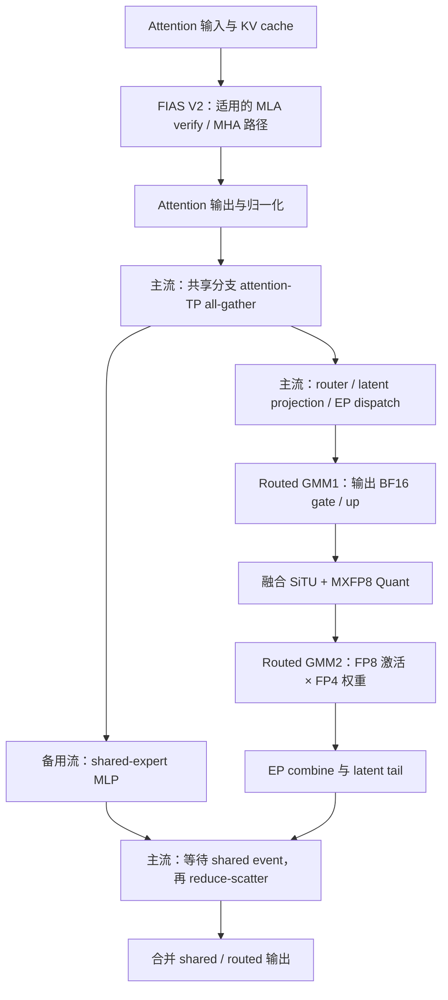
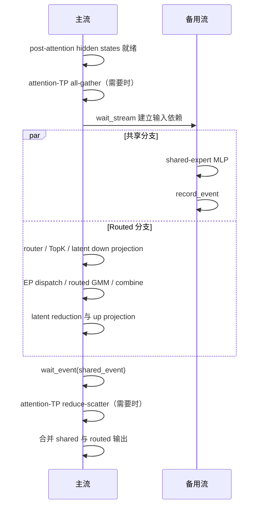

# Kimi K3 在 Ascend 950DT 上的性能优化设计

## 1 功能概述

本文面向 Ascend 950DT 的 Kimi K3 推理，目标是缩短 attention、MoE 和 DSpark 验证关键路径，减少重复投影、输入连续化、量化及中间数据搬运，并提供评估专家负载和尾时延所需的观测能力。

设计覆盖两个指定仓库中 hanwlax 编写、提交或执行合并的相关改动。共享专家 TP 子组和 EPLB 是他人实现、由 hanwlax 合入的协作项，单独标注；共享专家细粒度重叠、图更新 worker 等其他集成仅说明与本设计的边界。不能把分支的全部变更归为 hanwlax 独立实现。

| 优化位置 | 功能 | 设计目的 |
| --- | --- | --- |
| KDA 投影及 verify | Full-rank QKVG 融合、ModelSlim 加载适配、按 stride 读取 packed 输入 | 减少投影调用和逐层连续化副本 |
| 共享专家 | 基础双流及可选共享专家 TP 子组 | 隐藏共享 MLP 延迟，权衡通信和权重内存 |
| MLA/MHA attention | FIAS V2 接口和图内动态长度更新 | 接入适用的 NPU attention 执行路径 |
| Routed MoE | DeepEP low-latency MXFP8、SiTU＋MXFP8 融合 | 避免 GMM 前重复量化，减少中间访存 |
| DSpark acceptance | NPU chain rejection sampling 及随机数布局 | 使用正确的 NPU 实现和请求行 stride |
| MLA cache | 非 MLAPO 路径写 NZ，prefix 读取恢复逻辑页 | 保持 NZ attention 与缓存复用语义一致 |
| 负载与观测 | K3 专家 placement、DeepEP AUTO 统计、rank 过滤 trace | 支持分析不均衡和性能回归，不直接宣称吞吐提升 |

W4A8 路径使用 packed MXFP4 权重和 MXFP8 激活。本文中的 SiTU 融合优化运行时激活量化，保留权重格式和 GMM 数值接口；不重新定义离线量化算法。本文不填入未测量的 950DT 加速比。

### 1.1 基线与归属口径

`zzx` 为 Git remote 名称，对应 GitHub 所有者 `zhaozx-cn`。两仓库均以 `a5-k3-0828` 为分支，已通过 GitHub 核对分支头：

| 仓库 | 固定快照 |
| --- | --- |
| [zhaozx-cn/sglang](https://github.com/zhaozx-cn/sglang/tree/63aa7f7ca193eb628359b651f00553853ce77f65) | `63aa7f7ca193eb628359b651f00553853ce77f65` |
| [zhaozx-cn/sgl-kernel-npu](https://github.com/zhaozx-cn/sgl-kernel-npu/tree/c8c10f7cff20b8d11d403b4e4e37aa3114ba909e) | `c8c10f7cff20b8d11d403b4e4e37aa3114ba909e` |

核对日期：2026-09-14。下表区分作者、提交者与合并操作者；merge commit 的作者信息表示执行合并，不等于 PR 内全部代码的作者。设计以主题引入提交和固定快照的最终接入共同说明。SR 编号仅用于本文追踪；DPR 分析性能、资源、可靠性、兼容性和可观测性，不代替实际验收报告。

### 1.2 框架与算子来源

| 设计主题 | Commit | 作者 | 提交者 | 归属说明 |
| --- | --- | --- | --- | --- |
| 共享专家基础双流 | [f3ca9cb559](https://github.com/zhaozx-cn/sglang/commit/f3ca9cb559d3dd34ff7ff41d2ad4147fbff4f6db) | hanwlax | hanwlax | hanwlax 实现；经 #1 进入目标分支 |
| Full-rank QKVG 与 ModelSlim 映射 | [6d48f564a6](https://github.com/zhaozx-cn/sglang/commit/6d48f564a6cfed76c294cac8f97153ab87e01afc) | hanwlax | hanwlax | hanwlax 实现；经 #1 合入 |
| QKVG 权重加载条件修正 | [6ffc661d88](https://github.com/zhaozx-cn/sglang/commit/6ffc661d88f74558ceaf2f6a016a76bd09ae29aa) | hanwlax | GitHub | hanwlax 实现，#4 |
| FIAS V2 与图内长度更新 | [8491b10adf](https://github.com/zhaozx-cn/sglang/commit/8491b10adf34d76d4bedf94530750e816945d53a) | hanwlax | GitHub | hanwlax 实现，#6 |
| DeepEP MXFP8 分派 | [f5d724b641](https://github.com/zhaozx-cn/sglang/commit/f5d724b641de052d403f4538a33cdaab16b23c3c) | hanwlax | GitHub | hanwlax 实现，#11 |
| SiTU＋MXFP8 框架接入 | [ff2f4caf69](https://github.com/zhaozx-cn/sglang/commit/ff2f4caf6904fae4072dcab9f1879a8c53b1125b) | hanwlax | GitHub | hanwlax 实现，#13 |
| NPU chain rejection sampling | [c4ab122939](https://github.com/zhaozx-cn/sglang/commit/c4ab122939adcdec78bb64ea31593c61c47a39ae) | hanwlax | hanwlax | hanwlax 实现；经 #19 合入 |
| NZ 写入与逻辑 prefix 读取 | [6f3acbf4c0](https://github.com/zhaozx-cn/sglang/commit/6f3acbf4c0d74b85a19dc4747f41a7695dc91906) | hanwlax | GitHub | hanwlax 合并 #34；含其 prefix 读取修正 |
| 共享专家 TP 子组 | [13e5168c68](https://github.com/zhaozx-cn/sglang/commit/13e5168c684858c3849709c2bf75c5e42564311b) | hanwlax | GitHub | Hexq0210 实现，hanwlax 合并 #35 |
| 专家 placement、AUTO 统计与 trace | [63aa7f7ca1](https://github.com/zhaozx-cn/sglang/commit/63aa7f7ca193eb628359b651f00553853ce77f65) | hanwlax | GitHub | qybnb 实现，hanwlax 合并 #39 |

| 设计主题 | Commit | 作者 | 提交者 | 归属说明 |
| --- | --- | --- | --- | --- |
| KDA verify 显式 stride，省去五个输入副本 | [34c6ad799d](https://github.com/zhaozx-cn/sgl-kernel-npu/commit/34c6ad799d1806c59b7e48798148e43cf0fe7055) | hanwlax | hanwlax | hanwlax 实现；由 zzx 合并 #1 |
| A5 SiTU＋MXFP8 AscendC、注册、构建及测试 | [bc34b34725](https://github.com/zhaozx-cn/sgl-kernel-npu/commit/bc34b347259e062ed43a9edc7abf656444d93339) | hanwlax | GitHub | hanwlax 实现，#5 |

## 2 SR设计

| SR | 需求 | 设计约束 | 验收判据 |
| --- | --- | --- | --- |
| P-SR-01 | 减少 KDA 投影和 verify 数据整理 | 融合宽投影，按真实 stride 读取 Q/K/V/a/b | 权重分片及结果正确；连续化调用与耗时减少 |
| P-SR-02 | 优化共享专家关键路径 | 主/备用流依赖明确；共享 TP 大小合法 | 共享/routed 结果一致；记录真实重叠及等待 |
| P-SR-03 | 接入 FIAS V2 并正确重放图 | 区分 BNSD/TND 和捕获模式；更新长度后 replay | 页边界、padding、IDLE rank 的输出正确 |
| P-SR-04 | 打通 MoE 的 MXFP8 激活链路 | normal BF16 / low-latency MXFP8；payload/scale/counts 联合传递 | GMM1/GMM2 不重复量化，端到端精度满足要求 |
| P-SR-05 | 匹配 NPU DSpark acceptance 接口 | NPU 采样实现与随机数行宽一致 | 接受索引、bonus 和边界访问符合接口 |
| P-SR-06 | 保证 NZ 缓存写入和复用正确 | 逻辑页和物理 tile 顺序互相映射 | 新写、prefix hit、跨页及 eager/graph 一致 |
| P-SR-07 | 提供可信的负载与性能观测 | 逻辑/物理专家映射、AUTO 分派统计及 rank 过滤一致 | 统计不重复不遗漏，trace 可关联配置 |

## 3 实现思路

Kimi K3 的单层执行中，attention 与 MoE 是不同的计算阶段；MoE 内部又包含共享专家和 routed experts 两条可并行的分支。投影与 verify 优化之外，三项主要优化分别作用于不同位置。



图中是启用 attention-TP 共享专家通信时的逻辑关系。无需该通信的配置可直接将本地输入交给共享 MLP。SiTU 融合位于 **routed experts 的 GMM1 与 GMM2 之间**，不等同于共享 MLP 中可能出现的 DynamicQuant，也不会自动改变共享专家的权重格式。

各项改动的收益需要分别测量：双流改变执行重叠，FIAS V2 改变 attention 调用，SiTU 融合减少 routed 分支内部的工作。融合缩短 routed 分支后，原先被隐藏的共享分支耗时可能重新暴露，因此各项加速比不能直接相乘。

在图示主链之外，QKVG 融合和 stride verify 减少 KDA 输入侧开销；NPU rejection sampling 位于 target verify 后的接受阶段；NZ 写入与 prefix 读取约束 attention 前后的缓存布局。共享专家 TP 和专家负载统计作为整模型配置和观测能力共同参与评估。

优化顺序以数据契约为前提：先保证模型权重及状态正确，再验证 attention/量化/通信接口，最后比较关键路径。吞吐变化同时受接受长度和专家负载影响，必须随性能结果一并记录。

## 4 实现设计

### 4.1 QKVG 融合与 KDA verify 输入副本消除

Full-rank K3 将对齐友好的 Q/K/V/G 宽投影合并为 `fused_qkvg_proj`；小维度 beta 和 forget-gate 投影保留各自路径。融合模块按 `attn_tp_rank/attn_tp_size` 分片，支持 DP attention 下 attention TP 与全局 TP 不相同的情况。旧 low-rank 路径仍受 `do_fuse_qkvbfg` 条件约束，不能将两类条件混用。

`6d48f564a6` 为 `KimiK3LinearForCausalLM` 添加 packed module 映射，将融合模块关联到 checkpoint 的 q/k/v/g 模块名，使 ModelSlim 能解析对应方案；`6ffc661d88` 修正 weight loader，对 full-rank 融合模块按 `use_full_rank_gate` 判断，避免仅检查旧融合标志而跳过权重。需要在加载后核对各投影分片内容，不能仅检查模型能够构造。

外部算子提交 `34c6ad7` 使 `kda_target_verify_npu` 显式接收 Q/K/V/a/b 的 token、head 和 dim stride，取消这五个输入的 `.contiguous()`；A_log、dt_bias 和索引仍进行各自连续化。返回值显式分配为连续 `[1,N,Hv,V]`，避免继承非连续 V 的输出布局。该改动不取消 conv 输入整理，也不意味着整层没有复制。

固定快照中的 `AscendKDAAttnBackend` 从 `sgl_kernel_npu.fla.kda_target_verify` 导入该接口。调用方先用 `fused_kda_gate_npu(..., lower_bound=layer.lower_bound)` 生成 log-decay，并对 beta 执行 FP32 sigmoid，再明确设置 `gates_are_preactivated=True`。外部接口已经移除 `lower_bound` 参数，原始 gate 分支只包含 softplus 形式；下界语义必须在预激活端完成。

此优化保持固定宽度请求和状态快照语义，不能因为支持输入 stride 就宣称支持任意 ragged 或树状验证。与 `0729_dspark` 内置算子要求 Q/K/V/gate 连续化的行为不同，两个基线应独立引用。

### 4.2 共享专家双流与 TP 子组

#### 4.2.1 原有依赖与改动边界

共享专家和 routed experts 都读取 post-attention RMSNorm 后的 hidden states。只要输入就绪，两条分支即可独立计算，直到最终输出相加时才需要会合。

在 `f3ca9cb559` 之前，`_sbo_shared_overlap` 的启用条件排除了 `_shared_experts_attn_tp_comm`。这使 NPU attention-TP 兼容模式即使已具备备用流，也不能使用共享专家重叠。该提交移除此排除条件，并把共享分支拆成三个执行部分：

| 阶段 | 执行位置 | 目的 |
| --- | --- | --- |
| 输入 all-gather | 主流、attention-TP 组 | 将 token shard 恢复为 TP 分片共享 MLP 所需的输入批次 |
| Shared MLP | 备用流 | 与 routed 分支计算及 EP 通信重叠 |
| 输出 reduce-scatter | 主流、attention-TP 组 | 将共享专家部分和还原为本 rank 的 token 行 |

同一提交同时调整了 NPU 的发射时机：在 router、TopK 和 latent down projection 之前启动共享分支，使输入一旦就绪就开始 all-gather，并让共享 MLP 的前置工作尽早进入设备执行队列。源码注释提出的动机之一，是让共享分支较轻的 DynamicQuant 有机会在 routed GroupedMatmul 开始前完成；是否达到这一重叠效果需要通过 950DT trace 确认。

#### 4.2.2 启用条件与数据布局

双流的基本条件为：

```text
_sbo_shared_overlap =
    EP all-to-all 路径启用
    AND shared_experts 存在
    AND alt_stream 存在
```

Attention-TP 共享专家通信还要求启用对应共享专家 TP 配置，并且 `attn_tp_size > 1`。在该模式下，设每个 rank 的输入为 `[M_local,H]`，attention-TP 大小为 `A`，则共享分支读取 gather 后的 `[A*M_local,H]`；共享 MLP 输出经 reduce-scatter 回到 `[M_local,H]`，再与 routed 输出相加。

该提交没有新增专门控制这项共享专家双流的环境变量。不能仅依据 `SGLANG_NPU_USE_MULTI_STREAM` 的名称判断本路径是否启用，应检查上述模型条件和实际发射路径。NPU 在这里采用未合并的 MoE front 路径；量化参数和 native kernel 的布局继续由原有实现管理。

#### 4.2.3 流依赖与生命周期



实现中的依赖包括：

1. 主流完成共享输入准备后，备用流通过 `wait_stream(current_stream)` 等待该时点之前的主流工作。
2. `shared_input.record_stream(alt_stream)` 记录备用流对输入的使用，防止分配器过早回收相关内存；它不替代数据就绪依赖，也不允许调用方在计算完成前覆盖该缓冲区。
3. 备用流只执行 `shared_experts(shared_input)`，完成后记录事件。
4. 主流尽量晚地等待事件：latent MoE 路径在 routed combine、latent reduction 和 up projection 后等待；非 latent 路径在专家输出产生后等待。
5. 事件依赖满足后，主流完成共享分支的 reduce-scatter，再消费共享输出。

`wait_stream`、`wait_event` 建立设备执行依赖，不要求为每个阶段做主机侧全设备同步。代码中接口名称带 `torch.cuda`，但本节描述的是 NPU 执行环境下的设备流适配语义。

HCCL collective 保留在主流，使本改动不需要把共享分支的通信迁移到备用流。该方案并没有把共享分支的 all-gather 和 reduce-scatter 同时并行化；被移到备用流的是共享 MLP。

#### 4.2.4 预期收益与约束

忽略不同设备资源之间的竞争，用 `T_ag`、`T_shared`、`T_routed`、`T_rs` 分别表示共享输入通信、共享 MLP、routed 分支和共享输出通信耗时，可得到粗略模型：

```text
串行时间 ≈ T_ag + T_shared + T_routed + T_rs
双流时间 ≈ T_ag + max(T_shared, T_routed) + T_rs + T_dependency
```

潜在收益来自隐藏较短分支的耗时，实际收益受计算单元、HBM 带宽、通信和事件开销影响。共享 MLP 提前发射也可能与 routed front 争用资源，应以实际关键路径缩短为准，而不是仅以 trace 上出现两条流为准。

空 token 输入不发射共享 MLP。Routed EP 路径对空 DP rank 的 collective 参与仍由原有逻辑维持，不能因为本地没有共享计算而跳过整个 MoE。输入缓冲区应持续有效直到共享事件完成；跨 rank 的 collective 调用顺序也必须一致。

#### 4.2.5 固定快照中的子组与后续集成

前述主流 AG/RS＋备用流 MLP 描述 `f3ca9cb559` 的基础双流。固定快照中的 #35 将通信字段调整为 `_shared_experts_tp_comm`，并通过 `--shared-experts-tp-size` 选择 attention TP 内的共享专家子组。

设 attention TP 为 A、共享专家 TP 为 S，则 S 必须为 A 的正因子，共享专家 intermediate size 也必须被 S 整除。S=1 复制权重；S>1 在对应子组分片权重，以 `[S*M_local,H]` 缓冲执行 all-gather，并在相同组内 reduce-scatter。未显式设置 S 时，沿用原 `--enable-shared-experts-attn-tp` 行为。该设置只支持 Kimi-K3 和 EP all-to-all 后端。

基础双流仍只把 MLP 放到备用流。分支另有非 hanwlax 合入的细粒度重叠路径，由默认关闭的 `SGLANG_NPU_FINE_GRAINED_MOE_DUAL_STREAM` 控制，满足条件时可把共享 collective 放到备用流。测量本设计的基础双流时应关闭该开关；不能把基础路径的“AG/RS 在主流”描述成整个快照所有配置的唯一行为。子组改变权重内存、gather 行数和 collective 开销，应独立消融。

### 4.3 FIAS V2 接入

#### 4.3.1 分派范围

`SGLANG_NPU_USE_FIAS_V2_BSND` 默认关闭。Backend 和 graph runner 都以“该开关开启且 speculative algorithm 为 DSpark”作为新增分派条件。

| 路径 | 本项接入行为 |
| --- | --- |
| K3 MLA target verify | 将固定宽度 Q 转为 BNSD，调用 `npu_fused_infer_attention_score_v2` |
| Draft MHA 的 verify / draft-extend-v2 路径 | 使用 V2 接口，保持 TND 输入 |
| 既有 hybrid SWA 分支 | 已存在 V2 分派条件；本次增加的是 DSpark 开关条件 |
| 普通 decode、其他 prefill 或 KDA 线性注意力 | 不能仅因开启此开关就视为全部切换到 V2 |

环境变量名称保留了 `BSND` 字样，但 **MLA 实际传给 V2 的 `input_layout` 是 `BNSD`**。MHA 分支传入的是 `TND`，两者的 Q 长度参数含义也不同。

#### 4.3.2 MLA 输入与输出布局

设 `B` 为请求数，`T` 为该 backend 的每请求固定验证宽度，`Hq` 为实际送入算子的 query head 数（可能含头 padding），`Dc` 为 `kv_lora_rank`，`Dr` 为 RoPE 维度。

| 对象 | 进入适配前 | V2 接口 |
| --- | --- | --- |
| `q_nope` | `[B*T,Hq,Dc]` | `[B,Hq,T,Dc]`，通过 view、transpose、contiguous 生成 |
| `q_rope` | `[B*T,Hq,Dr]` | `[B,Hq,T,Dr]`，与 `q_nope` 使用相同行序 |
| 压缩 KV | Paged cache，逻辑布局 `[blocks,Hkv,page,Dc]` | 沿用已有缓存，作为 key/value 传入 |
| RoPE KV | Paged cache，逻辑布局 `[blocks,Hkv,page,Dr]` | 作为 `key_rope` 传入 |
| Attention 输出 | V2 返回 `[B,Hq,T,Dc]` | 转置回 `[B*T,Hq,Dc]`，裁去 padding heads 后恢复模型输出布局 |

该接入不为了 query 布局转换而整体重排持久 KV cache。`num_query_heads` 使用头 padding 后的实际 head 数，不能与原始有效 head 数混用。

调用前断言 `q_nope.shape[0] == B*T`，保证每个请求对应一个固定长度块；`B=0` 时返回空 attention 输出，跳过 V2 发射。该断言不提供 ragged MLA query 支持。

V1 路径原来显式调用 workspace 查询和 `.out` 接口；V2 路径通过一次 Python V2 接口调用交给 `torch_npu` 管理。此处只能确认调用方式变化，不能据此推断底层 device kernel 数量或 workspace 成本已经降为某个固定值。

#### 4.3.3 长度与 mask 契约

| 属性 | MLA BNSD verify | MHA TND 路径 |
| --- | --- | --- |
| Q 长度 | `actual_seq_qlen=[T]*B`，每请求长度 | `actual_seq_qlen` 为累计 token 边界；draft-extend-v2 使用真实 extend 长度累加 |
| KV 长度 | `actual_seq_kvlen`，每请求实际 KV 边界 | 同名 V2 参数，由 metadata 提供 |
| 缓存位置 | `block_table` 与 `block_size` | 沿用对应全注意力 / SWA block table |
| Mask | `mtp_mask`，`sparse_mode=3`，`pre_tokens=FULL_ATTENTION_WINDOW`，`next_tokens=0` | 沿用既有 encoder/full/SWA 分支的 mask、sparse mode 和窗口语义 |

在 MLA 非图模式中，query、block table 和 KV 长度列表按实际请求裁剪；存在 token padding 时，输出按原有逻辑恢复外层 shape。Target 与 draft 使用各自解析后的请求宽度，不能统一套用同一个 speculative token 数。

Block table 的覆盖范围和算子消费的 KV 长度必须对应同一轮状态。接入提交保留了 target verify 的 CPU 长度来源，并处理空 attention-DP rank，避免空张量求最大值以及页边界处的缓存覆盖不足。

#### 4.3.4 图捕获与重放

FIAS V2 使用 `actual_seq_kvlen` 作为动态长度更新字段，不能继续使用 V1 的 `actual_seq_lengths_kv`。图更新必须选择与**捕获时算子版本**一致的字段。

`_uses_v2_seq_len_update()` 因此检查捕获模式 `capture_forward_mode`。运行时处于 IDLE 的 DP rank 仍可能重放 target-verify 图；若只检查本轮运行模式，会选错字段，使 V2 保留旧 KV 长度。

```text
准备本轮 seq_lens
    → 选择捕获图对应的更新字段
    → graph.update(cpu_update_input=[{"actual_seq_kvlen": seq_lens}]) 完成
    → graph.replay()
```

对于 DSpark target verify，CPU 侧已经发布最终验证 KV 边界，graph runner 直接使用该值，不能再次加验证宽度。为了重放较大 capture batch，实际请求之外的长度补零。

FIAS V2 接入提交将更新顺序改为先完成 `graph.update()`，再调用 `graph.replay()`。编制时的分支已将 update 放入复用的设备绑定 worker，但仍等待 `update_future.result()` 后才 replay；这一后续实现保持了同一正确性约束，作为当前快照的集成依赖记录。

部署依赖 `torch_npu` 的 V2 graph handler 支持更新 `actual_seq_kvlen`。只确认 eager V2 调用可用，不足以证明图重放已正确接入。

#### 4.3.5 性能取舍

FIAS V2 的目标是改善对应 attention 阶段的执行效率，同时满足固定宽度验证和动态图长度要求。MLA 新增了 query 和输出的转置、连续化成本，因此应测量完整 `forward_mtp`，同时拆分 V2 算子时间与布局整理时间。

本项不实现 FIAS V2 内部的计算分块，也未在该提交中提供足以量化 950DT 收益的基准结果。模型级评估必须覆盖上下文长度、batch、验证宽度和图命中率，不能把单次接口替换等同于端到端加速。

### 4.4 DeepEP MXFP8 分派

`NPUW4A8MXFP4MoEMethod` 在加载 w13 时设置两类 dispatcher 输出：normal 使用 BF16，low-latency 使用 MXFP8。原因是 A5 normal MXFP8 分派受单机支持范围限制，保留 normal BF16 能兼容 `--deepep-mode auto` 中的多机 prefill。

Low-latency dispatcher 除已有 `use_fp8=True` 外，明确向 `buffer.low_latency_dispatch` 传递 `quant_mode="mx_fp8_e4m3"`，区分旧 NPU FP8 标志对应的 INT8 路径。返回 MXFP8 payload 和匹配的 E8M0 scale，GMM1 直接消费已有 scale；normal 路径仍由 GMM 的既有逻辑在必要时量化。

该配置针对 GMM1 输入，而下一节的 SiTU 融合针对 GMM2 输入，不能互相替代。有效 expert counts、payload 与 scale 的行顺序必须一致；CPU mock 单测只能验证分派和参数传递，不能证明设备量化精度或跨机通信性能。

### 4.5 SiTU 与 MXFP8 量化融合

#### 4.5.1 GMM2 前的量化需求

`NPUW4A8MXFP4MoEMethod` 使用 MXFP4 权重和 MXFP8 激活。原路径的 GMM1 输出先经过 SiTU，得到 BF16 激活；SiTU 不返回 MX scale，因此 GMM2 的 `apply()` 发现 `pertoken_scale is None` 后，再调用 `npu_dynamic_mx_quant`。

```text
原路径：
GMM1 → BF16 [capacity,6144]
     → SiTU → BF16 [capacity,3072] 写回 GM
     → npu_dynamic_mx_quant → FP8 payload + E8M0 scale
     → GMM2

融合路径：
GMM1 → BF16 [capacity,6144]
     → SiTU + BF16 舍入 + MXFP8 Quant（在片上完成）
     → FP8 payload + E8M0 scale
     → GMM2 直接消费，跳过重复量化
```

优化保留 W4A8 的数值接口，不把 GMM2 改成 BF16 matmul，也不在每次 SiTU 调用中重新量化权重。GMM2 的已有 `pertoken_scale` 接口就是融合结果的接入点。

#### 4.5.2 框架分派与接口

SGLang 增加 `NPUSituMXFP8Quant` 包装器，只有以下条件同时成立时选择它：

- MoE 使用 DeepEP 分派。
- 激活配置为 `situ`。
- `w2_kernel` 为 `NPUW4A8MXFP4MoEMethod`。
- `SGLANG_NPU_MOE_SITU_MXFP8_FUSED=True`，该开关默认开启。

`beta` 来自 `gemm1_alpha`，未设置时为 4.0；`linear_beta` 来自 `gemm1_clamp_limit`，融合路径要求它非空。后者虽然使用 clamp 字段名传递，在本算子的计算中表示 tanh 缩放参数，不是硬截断阈值。

```text
situ_mxfp8_quant(
    hidden_states,
    group_list,
    group_list_type=1,
    beta=4.0,
    linear_beta=25.0,
) -> (payload, scales)
```

| 参数 / 结果 | 当前实现约束 |
| --- | --- |
| `hidden_states` | 连续 BF16 二维张量 `[C,6144]`，`C>0` 表示容量行数 |
| `group_list` | 同设备、连续、非空一维 `int32` 或 `int64` 张量 |
| `group_list_type=1` | 每个 expert 的 token 计数；有效行数为计数之和 |
| `group_list_type=0` | 累计 token 边界；有效行数取最后一个元素 |
| `beta / linear_beta` | 正数 |
| `payload` | `[C,3072]`，`torch.float8_e4m3fn` |
| `scales` | `[C,48,2]`，`torch.float8_e8m0fnu`；每 32 个激活共享一个 scale |

输出使用容量 shape，保证后续 GMM 接口不需要根据设备侧有效行数重新分配张量。每行包含 96 个量化块，scale 组织为 `[48,2]`，与 `npu_dynamic_mx_quant` 的逻辑布局一致。`pertoken_scale` 是沿用的接口名称，此处实际携带的是块级 scale，并非每行一个标量。

关闭融合开关后，runner 恢复原有 SiTU，再由 GMM2 执行动态 MX 量化。非 DeepEP 分派和其他量化方法仍采用各自原有路径。分派条件不会自动检查输入是否为 BF16 或宽度是否为 6144；如果已经选择融合路径但输入不符合算子约束，会报错，不存在自动回退承诺。

#### 4.5.3 SiTU 数值语义

将每行 6144 个元素按中点拆为两个 3072 维向量 `g` 和 `u`。SiTU 的计算为：

```text
gate_part = beta * tanh(g / beta) * sigmoid(g)
up_part   = linear_beta * tanh(u / linear_beta)
z_fp32    = gate_part * up_part
z_bf16    = round_to_bf16(z_fp32)
payload, scales = MXFP8QuantPer32(z_bf16)
```

这一公式不同于普通 `SiLU(g) * u`，不能用标准 SwiGLU 代替。当前 AscendC 实现在 FP32 中完成非线性运算，之后使用 BF16 舍入，再进行 MXFP8 量化。中间 BF16 舍入虽然不再写入 GM，仍被保留，以匹配原“SiTU 输出 BF16 → 动态量化”的计算边界。

Tanh 通过 `2*sigmoid(2x)-1` 实现，并调用 AscendC 的稳定 sigmoid 原语。相关向量计算之间插入 `PIPE_V` barrier，保证乘法、sigmoid 和加法之间的依赖顺序。

量化复用 MX 的指数提取、scale 计算和 FP8 转换逻辑。新增的 E4M3 有限值裁剪仅通过模板参数对本算子开启：缩放后的有限值在最终 cast 前限制到 E4M3 有限范围，避免边界舍入落入保留编码。它不是对 SiTU 输入做额外 hard clamp。

#### 4.5.4 有效行与并行划分

设根据 `group_list` 得到的有效行数为 `V`。Kernel 将其限制到容量上界，非正总量按零处理；只有前 `V` 行被读取和写入。

```text
V = group_list[-1]                   # cumulative 模式
    或 sum(group_list)              # count 模式
V = 限制到 [0, C]

block_dim     = min(C, max(AIV_core_count, 1))
rows_per_core = ceil(V / block_dim)
row_begin     = core_id * rows_per_core
row_end       = min(row_begin + rows_per_core, V)
```

每个 AIV core 顺序处理自己的连续行段。单行处理使用固定 6144/3072 宽度的片上缓冲区，完成输入搬入、SiTU、BF16 转换、量化和输出搬出。容量形状固定，但有效行数从设备上的 `group_list` 获取，生产算子不通过 `.item()` 回传有效行数。

这里的 `group_list` 用于确定**连续有效前缀的总行数**，不用于选择任意稀疏行。上游 dispatch 必须已将有效 token 按专家组织在容量缓冲区的前缀中；计数应非负，累计模式应单调，且真实有效行数不得超出容量。Kernel 的上界裁剪不能替代对路由 metadata 的一致性保证。

`payload` 和 `scales` 通过 `empty` 分配。无效尾部不初始化，`V=0` 时整个输出都没有有效数据。因此下游 GMM2 必须使用同一份 expert counts / group boundaries，只消费有效行，不能把输出的容量 shape 当成有效 token 数。

#### 4.5.5 片上流水与同步

单行内的执行依赖为：

| 阶段 | 同步与作用 |
| --- | --- |
| GM 输入搬入 UB | `MTE2_V` 事件保证向量计算读取到已就绪输入 |
| SiTU 及 BF16 转换 | 对有依赖的向量操作使用 `PIPE_V` barrier |
| MXFP8 payload / scale 生成 | 在片上读取 BF16 结果，生成输出和块级 scale |
| UB 输出搬回 GM | `V_MTE3` 事件保证量化结果完成后再搬运 |
| 复用单行缓冲区 | `MTE3_S` 事件保证本行输出搬运完成后再进入后续处理 |

Kernel 入口还保存并恢复所使用的浮点溢出控制状态。该提交将算子注册到 NPU 设备实现，并在 A5-only 构建条件下纳入 AscendC 编译；它采用无 workspace kernel 的构建路径，但仍需分配 payload 和 scales 输出。

#### 4.5.6 GMM2 的交接契约

Runner 将 `group_list` 和 `group_list_type` 传给融合 activation，再将返回的 `scales` 作为 `pertoken_scale` 传入 GMM2。已有 W4A8 `apply()` 在 scale 非空时只整理 scale shape，不再调用动态量化器。

GMM2 接收的关键参数为：

```text
hidden_states          = FP8 E4M3 payload
per_token_scale        = E8M0 block scales，逻辑 [C,48,2]
x_dtype                = float8_e4m3fn
weight_dtype           = packed float4_e2m1fn_x2
per_token_scale_dtype  = E8M0 dtype
antiquant_scale        = 对应 w2 的权重 scale
expert_tokens          = 与 activation 相同的专家分组信息
```

Payload、scale 和 expert metadata 必须一起传递。只替换 payload 而遗漏 scale 会触发后续重复量化；只按容量解释 payload 则可能把未初始化尾部作为有效激活。

#### 4.5.7 性能收益来源

融合有两项可分开验证的收益：

1. **合并计算阶段。** 将独立 SiTU 与后续动态量化的两次算子调用合并为一次，省去中间 BF16 激活的 GM 写回与再读取。只统计有效区域，`V` 行、`H=3072` 维的这部分中间往返对应约 `4*V*H` 字节。
2. **限制有效行处理。** 原基准中的动态量化接收完整容量张量；融合路径只处理路由 metadata 指定的有效前缀，减少无效尾部的量化工作。

当 `V` 接近 `C` 时，主要观察融合带来的发射和数据搬运收益；当 `V` 远小于 `C` 时，跳过无效行可能成为主要收益来源。算子仍按容量分配输出，因此计算减少不等同于分配容量按有效行数缩小。

### 4.6 NPU DSpark chain rejection sampling

`c4ab122939` 在 NPU 环境从 `sgl_kernel_npu.sample` 导入 `chain_speculative_sampling_triton`；其他设备保留原实现。接口接收 candidates、target/draft 概率和随机数，返回接受位置与预测 token，公共 DSpark 接受算法语义不在本提交中重新定义。

NPU 实现按候选宽度作为随机数行 stride，因此 `uniform_samples` 分配为 `[B,candidates.shape[1]]`；其他设备仍使用 `[B,γ]`。候选包含 root 槽，最后一个随机数有意不使用；final bonus 随机数仍为 `[B]`。不能为了缩短随机数数组而把 NPU 的宽度改回 γ，否则多请求行寻址会不一致。

验收需要覆盖首候选拒绝、部分接受、全部接受及 B>1；随机数 shape 改变会影响随机数序列消费，不以相同 seed 下跨设备逐 token 完全相同作为唯一判据。本文没有本项的独立加速测量。

### 4.7 MLA NZ 写入与 prefix 逻辑页恢复

#34 解除 `SGLANG_USE_FIA_NZ` 必须同时启用 MLAPO 的绑定，让普通 Kimi-K3 MLA 路径也能写入 FIA NZ 格式。分配的公开 shape 仍为 `[blocks,page_size,1,D]`，物理元素顺序为 `[blocks,D/16,page_size,16]`。

对逻辑槽 loc，令 `page=loc//page_size`、`slot=loc%page_size`，第 tile 个 16 元素块的物理行号为：

```text
row = (page * (D/16) + tile) * page_size + slot
```

`_mla_fia_nz_scatter_indices` 检查 D 被 16 整除且 page_size>0；NPU MLA pool 分别为 latent KV 和 RoPE KV 生成物理索引，将每个 token 展开成 D/16 个 tile 写入。`cache_v=None` 时先拆分 latent/RoPE，再执行 dtype 转换，避免对空对象调用转换。

Prefix 命中后，直接对公开 shape 做 `index_select` 得到的仍是 NZ 物理顺序。`gather_mla_cache_pages` 在选页后执行 view→permute→reshape，恢复 `[selected_blocks,page_size,1,D]` 的逻辑 token-major 顺序，再做 latent 投影或 RoPE 拼接；非 NZ 分支直接返回选中页。

这是一组写入和读取必须同时生效的改动。改变 NZ 配置时需重建缓存，不能直接复用旧布局内容；prefix hit 的重排成本也必须计入完整 attention 时延。共享 shape 不表示跨布局数据可直接交换。

### 4.8 专家 placement 与性能观测

#39 将逻辑 routed experts 与物理专家槽分开：物理容量为逻辑专家数加冗余专家数；TopK 仍选择逻辑专家，然后通过 `ExpertLocationDispatchInfo` 映射到实际装载权重的物理槽。存在有效 placement metadata 时，不能绕过映射而直接使用 fused-front 的预计算 TopK。

DeepEP AUTO 的统计器按本轮模式计数：extend/prefill 的 normal 路径记录映射后的物理 TopK，low-latency 路径通过接收 hook 记录真实接收计数，两者在 collect 时汇总，避免把 padding 或模式切换误记为负载变化。K3 同时暴露 expert-location 模型配置，并接入按 rank 选择的 profiler trace。

本项为性能分析和 EPLB 正确运行提供条件。是否降低尾时延需要在相同路由负载下验证；不能用“支持负载均衡元数据”代替均衡策略已生效或吞吐已提高的结论。

## 5 实现接口设计

接口均在进程内；外部生成协议保持既有形式。配置接口见第 6 章。

| 接口 / 模块 | 输入 → 输出 | 关键契约 |
| --- | --- | --- |
| `KimiK3DeltaAttention.fused_qkvg_proj` | hidden → packed Q/K/V/G | 使用 attention TP 分片；ModelSlim 映射与 weight loader 条件一致 |
| `sgl_kernel_npu.fla.kda_target_verify.kda_target_verify_npu` | Q/K/V/gate、初始状态及快照索引 → `[1,N,Hv,V]` | Q/K/V/a/b 使用真实 stride；固定宽度；预激活 gate 已含 lower_bound |
| `_gather_shared_expert_inputs` / `_reduce_scatter_shared_experts` | 本地 token shard ↔ 子组完整行 | 权重分片、行序与同一 shared TP 组匹配 |
| `npu_fused_infer_attention_score_v2` | MLA BNSD 或 MHA TND Q/KV、mask、block table、长度 → attention 输出 | MLA Q 长度逐请求，MHA Q 长度为累计边界 |
| `graph.update(cpu_update_input=...)` | 本轮 KV 长度 → 更新捕获图 | V2 使用 `actual_seq_kvlen`，完成后才 replay |
| DeepEP `low_latency_dispatch` | 激活、expert IDs、`quant_mode="mx_fp8_e4m3"` → payload/scale/counts | 保留显式量化模式，normal 仍使用 BF16 |
| `situ_mxfp8_quant(hidden_states, group_list, group_list_type=1, beta=4.0, linear_beta=25.0)` | BF16 `[C,6144]` → E4M3 `[C,3072]` 与 E8M0 `[C,48,2]` | 有效行是连续前缀；未初始化尾部不得消费 |
| GMM `apply(..., pertoken_scale=...)` | payload、块 scale、group metadata → 专家结果 | scale 非空时跳过重复动态量化 |
| NPU `chain_speculative_sampling_triton` | candidates、概率、`uniform_samples[B,D]`、final 随机数 → 接受结果 | D 为候选实际宽度，含 root；有效行 stride 一致 |
| `gather_mla_cache_pages(cache, block_ids, *, is_nz)` | 物理页与逻辑页号 → token-major 页 | NZ 做 tile 反排，普通布局保持原选页结果 |
| `ExpertLocationDispatchInfo` / AUTO recorder | 逻辑 IDs、placement、实际接收计数 → 物理分派与负载统计 | normal 和 low-latency 分别使用匹配来源 |

SiTU 的 `group_list_type=1` 为逐专家计数和，0 为累计边界的末值。Python 包装检查二维宽度和 group_list_type，native host 进一步检查 dtype、连续性、设备、非空容量和正参数；已选融合但形状不支持时会报错，不自动降级。

### 5.1 源码模块映射

| 仓库 | 模块（相对仓库根目录） | 职责 |
| --- | --- | --- |
| sglang | `python/sglang/srt/models/kimi_k3.py` | QKVG、权重加载、共享专家和 placement |
| sglang | `python/sglang/srt/hardware_backend/npu/attention/ascend_kda_backend.py` | 外部 KDA verify 及预激活 gate |
| sglang | `python/sglang/srt/hardware_backend/npu/attention/ascend_backend.py` | FIAS V2、prefix 页读取 |
| sglang | `python/sglang/srt/layers/moe/token_dispatcher/deepep.py` | MXFP8 模式参数传递 |
| sglang | `python/sglang/srt/hardware_backend/npu/quantization/moe_methods.py` | W4A8 dispatcher 配置与 GMM scale 消费 |
| sglang | `python/sglang/srt/hardware_backend/npu/memory_pool_npu.py`、`attention/mla_cache.py`（同 npu 目录下） | NZ 写入和逻辑页恢复 |
| sgl-kernel-npu | `python/sgl_kernel_npu/sgl_kernel_npu/fla/kda_target_verify.py` | 显式 stride 的 verify |
| sgl-kernel-npu | `python/sgl_kernel_npu/sgl_kernel_npu/activation/situ_mxfp8_quant.py` | SiTU 融合 Python 接口 |
| sgl-kernel-npu | `csrc/situ_mxfp8_quant/op_host/situ_mxfp8_quant.cpp`、`op_kernel/situ_mxfp8_quant.cpp`（同算子目录下） | 参数校验、A5 tiling 和 device 实现 |
| sgl-kernel-npu | `csrc/pytorch_extensions.cpp`、`csrc/CMakeLists.txt` | NPU 注册和 A5-only 构建 |

## 6 安全配置设计

本设计不增加网络监听、身份认证、密钥或用户权限接口，沿用 SGLang 服务的部署边界。这里的安全配置重点是模型配置可信、请求状态隔离、设备内存访问有效和执行依赖完整。

仅从可信来源加载模型、draft 配置和算子库，并固定模型与软件版本；不把开发启动脚本中的远端地址、日志路径或临时绕过检查设置作为推荐配置。模型特征、KV、概率和状态快照属于请求数据，常态日志不输出其完整内容；调试产物按既有访问权限和保留策略管理。上述是部署要求，本文引用的提交未新增对应的认证或日志脱敏实现。

### 6.1 配置与集成条件

| 项目 | 条件 / 默认行为 | 集成要求 |
| --- | --- | --- |
| 共享专家基础双流 | 引入提交按 EP、共享专家和备用流条件自动选择 | 共享输入跨流有效；AG/RS 与 routed collective 的 rank 顺序一致 |
| `SGLANG_NPU_USE_FIAS_V2_BSND` | 默认 `False`，新增路径还要求 DSpark | 确认实际进入 MLA verify / MHA MTP；graph handler 支持 V2 更新字段 |
| `SGLANG_NPU_MOE_SITU_MXFP8_FUSED` | 默认 `True`，仅在匹配的 DeepEP＋SiTU＋W4A8 路径生效 | GMM1 输出为连续 BF16、宽度 6144；`linear_beta` 非空且为正 |
| 外部算子库 | 包含指定提交的 A5 算子构建 | 具有 `situ_mxfp8_quant` 注册、E4M3/E8M0 dtype 与所需 CANN 支持 |
| 下游 GMM2 | 通过 payload、scale、group metadata 联合消费 | 保持 MXFP8 块布局，跳过重复量化，不消费无效尾部 |

软件兼容性以实际构建和验证结果为准。部署记录应固定 950DT 驱动、CANN、PyTorch、`torch_npu`、SGLang 与 `sgl-kernel-npu` 的实际版本，并通过接口和运行验证确认兼容性。

FIAS V2 是 DSpark 相关 attention 路径的优化；SiTU 融合由 MoE 量化和分派方式决定，两者不是同一个开关控制。普通生成场景可能命中融合和双流，却不进入本项 FIAS V2 分支。

| 补充配置 | 默认 / 条件 | 约束和回退边界 |
| --- | --- | --- |
| `--shared-experts-tp-size` | 默认 None；显式值覆盖旧共享 attention-TP 选项 | 必须为 attention TP 正因子且整除 shared intermediate size；仅 K3＋EP all-to-all；1 表示权重复制 |
| `SGLANG_NPU_FINE_GRAINED_MOE_DUAL_STREAM` | 默认 False | 后续协作路径；基础双流消融时保持关闭，避免混入 collective 重叠收益 |
| DeepEP dispatcher dtype | W4A8 的 normal BF16 / low-latency MXFP8 | 由量化配置设置；不要将 use_fp8 标志直接等同 MXFP8 |
| `SGLANG_USE_FIA_NZ` | 未启用时使用原布局；不再强制依赖 MLAPO | 初始化时固定缓存布局，修改后重新启动并重建缓存 |
| 外部 KDA verify 接口 | 不接收 lower_bound | 框架必须先激活 gate；混用旧签名或旧原始 gate 语义会造成异常或精度错误 |

### 6.2 内存、同步与数据保护

有效 expert counts 必须非负、累计边界单调且不超过容量；融合 kernel 的 clamp 只限制处理行数，不能校验上游路由语义。Payload、scale 的无效尾部不初始化，GMM 和调试输出都不得将容量视为有效行数。

共享分支输入在备用流完成前保持有效；event 依赖覆盖当前轮，collective 的组、次序和参与 rank 一致。图更新必须完成后再 replay；空 rank 也按捕获模式选择更新字段。NZ 的源/目标布局与配置必须一致，索引必须在池容量范围内。

配置和 ABI 不匹配应在构建、启动或接口调用阶段失败；不能假定切换开关能修复已经写坏的状态。关闭融合可恢复分离激活路径；关闭 V2 选择原 attention 路径，但仍需重新建立对应的图。更改共享 TP 或 NZ 布局需要重新构建相应权重分片、通信组或缓存。Profiler 数据和模型张量按部署权限保存，rank 过滤只控制采集范围，不提供访问控制。

## 7 DPR分析

| 维度 | 分析 | 验收要求 |
| --- | --- | --- |
| 性能 | QKVG、stride verify、双流、FIAS、MXFP8 各作用于不同阶段；收益不可直接相乘 | 按单项与组合消融，测完整关键路径和额外布局/通信开销 |
| 资源 | 减少副本和 BF16 中间往返；共享 TP1 增加每卡权重；融合输出仍按容量分配 | 记录峰值内存、workspace、scratch、capture batch 和有效行比例 |
| 可靠性 | 权重分片、gate 下界、随机数 stride、NZ 顺序影响数值与状态 | 对照参考及联合生成；不能从接口可调用推断语义正确 |
| 兼容性 | A5-only SiTU、CANN V2 graph handler、E4M3/E8M0、DeepEP ABI 必须配套 | 固定两仓库快照和完整软件栈，不将 A5 结论外推其他平台 |
| 可观测性 | mode-specific expert 计数、rank trace 和接受长度用于解释长尾 | 记录真实分派模式、物理专家负载、graph 命中和采样配置 |

### 7.1 已有用例与三项核心优化验证

#### 7.1.1 已有验证内容与边界

外部融合算子提交包含以下三个精度用例：count＋int64、count＋int32、cumulative＋int64。每个用例容量为 128，计数为 `[0,7,13,0,9,3,0,5]`，有效行数为 37；输入为 BF16 `[128,6144]`。

参考路径先用 FP32 PyTorch 计算 SiTU，再转 BF16，随后调用 `npu_dynamic_mx_quant`。测试检查输出 shape/dtype，并在有效行上反量化比较，使用 `rtol=0.08、atol=0.08`；先比较 NaN 位置，再以 `equal_nan=True` 比较数值。该容差与 NaN 处理是现有算子测试设置，不等于整模型精度准入标准。

同一提交包含基准：容量 32768、有效行数 32，分别对原 SiTU＋动态量化路径和融合路径预热 5 次、测量 50 次，输出 p50 和平均时延。测量包含显式设备同步。此配置着重体现容量远大于有效行数的场景，不能单独代表高占用 batch 的收益。

这些是源码中已存在的测试和基准定义。本次文档编制没有在 950DT 上执行它们，也没有得到双流、FIAS V2 或融合算子的新增性能测量结果。代码中其他平台的双流性能注释不作为本文的 950DT 实测依据。

#### 7.1.2 正确性验证矩阵

| 对象 | 关键场景 | 检查内容 |
| --- | --- | --- |
| 双流 | Shared TP1 / attention-TP；单请求 / 多请求；空 DP rank；不同 routed 耗时 | 与串行参考的 MoE 输出一致；AG/RS 后行序匹配；无早读、缓冲覆盖或 collective 次序错误 |
| 双流图执行 | 多次 capture/replay；复用同一输入池；前后轮数据显著不同 | Event 依赖覆盖当前轮输入；不读取上一轮共享输出；重放中无生命周期问题 |
| FIAS V2 eager | MLA 固定宽度；MHA TND；头 padding；不同上下文和页边界 | V1/V2 有效输出、mask 与行序一致；KV 覆盖范围正确；裁剪与补齐不污染有效 token |
| FIAS V2 graph | KV 长度逐轮递增；较大 capture batch；IDLE rank；DSpark 最终 KV 边界 | 更新 `actual_seq_kvlen` 生效；update 完成后 replay；不重复添加 verify 宽度 |
| SiTU 融合 | 两类 group list、两种索引 dtype；零有效行；满容量；不均衡 expert counts | 有效前缀对应正确；cumulative 与 count 结果一致；GMM2 不使用无效尾部 |
| SiTU 数值 | 大正/负输入、零、小值、MX block 舍入边界、自定义 beta | 对齐 BF16 舍入边界；检查 payload/scale 联合反量化误差和有限值边界 |
| GMM 联合 | 融合开关开/关；同一 FP4 权重；相同专家路由 | GMM2 无重复量化，expert 输出及 MoE combine 输出在约定容差内一致 |
| 整模型 | 相同 checkpoint、请求与采样配置；DSpark 图命中/回退 | Logits、生成质量及接受长度分布满足业务精度要求 |

零有效行测试应检查“下游不消费这些行”，不能检查未初始化 payload 一定为零。现有精度用例未覆盖 cumulative＋int32、极端数值、零有效行和图捕获，需按上述矩阵补充。

#### 7.1.3 性能消融

固定 checkpoint、TP/DP/EP、共享专家 TP 配置、上下文长度、输出长度、并发、验证宽度、采样参数、图配置和路由负载，分别建立以下对照：

| 对照组 | 双流 | FIAS V2 | SiTU 融合 | 目的 |
| --- | --- | --- | --- | --- |
| 基线 | 串行共享分支 | 原接口 | 分离实现 | 建立同条件参考 |
| 单项 A | 启用 | 原接口 | 分离实现 | 评估共享 MLP 重叠 |
| 单项 B | 串行共享分支 | 启用 | 分离实现 | 评估 attention 接入 |
| 单项 C | 串行共享分支 | 原接口 | 启用 | 评估融合与有效行处理 |
| 联合 | 启用 | 启用 | 启用 | 评估最终关键路径与相互影响 |

串行双流对照应保持相同 EP 和共享专家分片，使用只改变 shared 分支调度的受控构建。改为无 EP 或移除共享专家会同时改变计算和通信，不能作为有效对照。FIAS V2 和 SiTU 融合的对照使用第 6.1 节中的两个环境开关。

记录指标包括：

- 端到端输出吞吐、ITL/TPOT、TTFT 及长尾；DSpark 同时记录接受长度和实际验证 token 数。
- Shared MLP、routed 分支、AG/RS、事件等待分别占用的时间，以及它们在 trace 中的真实重叠范围。
- FIAS V2 内核、query/output 布局整理、graph update 和 replay 的完整开销。
- SiTU＋Quant 的完整调用时间、有效行数/容量比、GMM2 前的动态量化调用是否消失，以及融合前后带宽开销。

SiTU 基准需要同时覆盖 `V≈C` 和 `V≪C`，才能区分融合收益与跳过无效行的收益。首轮编译、算子预热和图捕获应与稳态测试分开记录；不能把初始化成本的差异计为稳态 token 加速。

### 7.2 扩展验证矩阵与覆盖证据

| 对象 / SR | 固定快照已有证据 | 仍需执行或补充的验证 |
| --- | --- | --- |
| QKVG / P-SR-01 | `6d48f564a6`、`6ffc661d88` 的模型与 loader 改动 | TP=attention TP 和不相等场景；各 packed shard 的权重和值对照 |
| stride verify / P-SR-01 | 外部 `34c6ad7` 的五类输入 stride 改动 | Packed 非连续 Q/K/V/a/b 与连续参考；预激活 lower_bound；每步快照；复制次数和时间 |
| MXFP8 dispatch / P-SR-04 | `test/registered/unit/layers/moe/test_npu_mxfp8_deepep_dispatch.py` 的 CPU mock | NPU payload/scale 精度、空 rank、normal/low-latency 切换和多机 prefill |
| NPU acceptance / P-SR-05 | `c4ab122939` 的设备分派与随机数宽度修正 | B>1、不同行接受长度、全接受/首步拒绝、概率统计与越界检查 |
| NZ / P-SR-06 | `test/registered/unit/npu/attention/test_npu_mla_cache.py` 的逻辑页与物理布局用例 | NPU 实际 scatter、prefix 命中后的 logits、跨页、图重放及布局切换后的重建 |
| Shared TP / P-SR-02 | #35 的参数检查、子组和模型分片实现 | S=1、中间因子、S=A，基础双流和串行对照，collective 次序及内存峰值 |
| Placement/观测 / P-SR-07 | `test_kimi_k3_expert_location.py`、`test_expert_distribution_deepep_auto.py`、`test_profiler_rank_filter.py`（位于 registered/unit 对应模块目录） | 冗余专家实际装载、模式混合统计、多 rank trace 与真实物理负载核对 |

已有源码用例只表示已交付验证代码，本次未执行 CPU 或 NPU 测试。性能基线应在第 7.1 节三项对照之外，增加 QKVG、stride verify、dispatch、NZ、共享 TP 与 EPLB 的独立对照；其余配置和路由负载保持一致。量化分派和模型分片若没有现成关闭开关，应使用仅回退对应改动的受控构建，不能编造配置开关。

记录吞吐、TTFT、TPOT/ITL 的中位数和长尾、接受长度分布、实际 token 数、有效专家行/容量、内存峰值与重复量化调用。区分 prefill、decode、DSpark verify 和 prefix hit，分别报告编译/捕获成本与预热后的稳态表现。业务 SLA 与整模型精度阈值未在需求中给出，验收前应明确，本文不虚构具体目标值。

## 8 分配需求

| SR | 分配模块 / 责任域 | 交付与验收证据 | 状态 |
| --- | --- | --- | --- |
| P-SR-01 | K3 模型/loader；Ascend KDA backend；外部 KDA kernel | 权重映射、非连续输入数值与复制成本对照 | 实现已合入；设备和整模型验收待执行 |
| P-SR-02 | K3 MoE；并行参数与通信组；性能验证 | 基础双流依赖、共享 TP 子组、同配置 trace | 已合入；不同 S 的收益待测 |
| P-SR-03 | Ascend attention；NPU graph runner；CANN 集成 | V2 长度、布局、IDLE 和多轮 replay | 已接入；软件栈联合验收待执行 |
| P-SR-04 | DeepEP dispatcher；MoE runner/quant method；外部 A5 SiTU 算子 | CPU 分派用例、SiTU 精度/基准、GMM 联合对照 | 两仓库已合入；端到端收益未测 |
| P-SR-05 | DSpark accept；sgl-kernel-npu sampling | 随机数布局及多请求接受边界对照 | 接口修正已合入；设备回归待执行 |
| P-SR-06 | NPU MLA pool；attention prefix 读取 | NZ 索引/反排单测与真实缓存复用验证 | 写读适配已合入；NPU 联合验收待执行 |
| P-SR-07 | K3 placement；EPLB recorder；profiler | 模式统计、专家映射、rank 过滤单测与 trace | 协作项已合入；真实负载评估待执行 |

分配按模块责任域给出，不将 Git 提交作者自动等同后续交付负责人。950DT 验收必须固定本章引用的两仓库构建和软件版本；DSpark 基础适配及早期内置算子分别见 [DSpark 设计](kimi_k3_dspark_design.md) 与 [NPU 算子设计](dspark_ascend_npu_kernels_design.md)，不混用两代接口契约。
