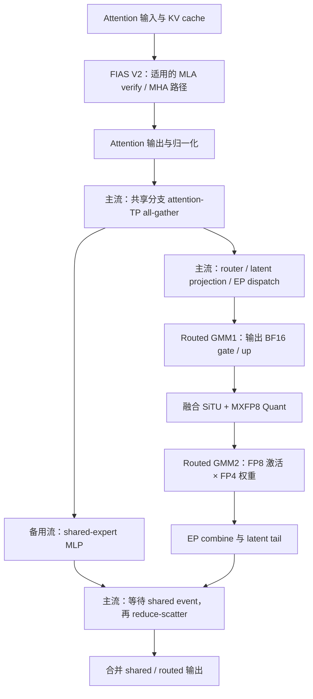
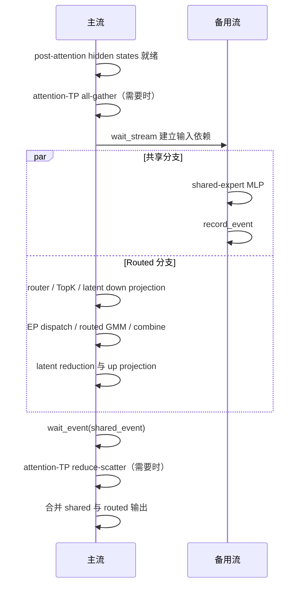

# Kimi K3 在 Ascend 950DT 上的性能优化设计

## 1 功能概述

| 优化位置 | 功能 | 设计目的 |
| --- | --- | --- |
| KDA 投影及 verify | Full-rank QKVG 融合、ModelSlim 加载适配、按 stride 读取 packed 输入 | 减少投影调用和逐层连续化副本 |
| 共享专家 | 基础双流及可选共享专家 TP 子组 | 隐藏共享 MLP 延迟，权衡通信和权重内存 |
| MLA/MHA attention | FIAS V2 接口和图内动态长度更新 | 接入适用的 NPU attention 执行路径 |
| Routed MoE | DeepEP low-latency MXFP8、SiTU＋MXFP8 融合 | 避免 GMM 前重复量化，减少中间访存 |
| DSpark acceptance | NPU chain rejection sampling 及随机数布局 | 使用正确的 NPU 实现和请求行 stride |
| MLA cache | 非 MLAPO 路径写 NZ，prefix 读取恢复逻辑页 | 保持 NZ attention 与缓存复用语义一致 |
| 负载与观测 | K3 专家 placement、DeepEP AUTO 统计、rank 过滤 trace | 定位专家负载不均衡和性能回归 |

W4A8 路径使用 packed MXFP4 权重和 MXFP8 激活。

## 2 实现思路

Kimi K3 的单层执行中，attention 与 MoE 是不同的计算阶段；MoE 内部又包含共享专家和 routed experts 两条可并行的分支。共享专家双流、FIAS V2 和 SiTU 量化融合分别作用于分支调度、attention 计算及 routed experts 的激活处理。



图中是启用 attention-TP 共享专家通信时的逻辑关系。无需该通信的配置可直接将本地输入交给共享 MLP。SiTU 融合位于 **routed experts 的 GMM1 与 GMM2 之间**，不等同于共享 MLP 中可能出现的 DynamicQuant，也不会自动改变共享专家的权重格式。

各项优化的收益需要分别测量：双流改变执行重叠，FIAS V2 改变 attention 调用，SiTU 融合减少 routed 分支内部的工作。融合缩短 routed 分支后，原先被隐藏的共享分支耗时可能重新暴露，因此各项加速比不能直接相乘。

在图示主链之外，QKVG 融合和 stride verify 减少 KDA 输入侧开销；NPU rejection sampling 位于 target verify 后的接受阶段；NZ 写入与 prefix 读取约束 attention 前后的缓存布局。共享专家 TP 和专家负载统计作为整模型配置和观测能力共同参与评估。

优化顺序以数据契约为前提：先保证模型权重及状态正确，再验证 attention/量化/通信接口，最后比较关键路径。吞吐变化同时受接受长度和专家负载影响，必须随性能结果一并记录。

## 3 实现设计

### 3.1 QKVG 融合与 KDA verify 输入副本消除

Full-rank K3 将对齐友好的 Q/K/V/G 宽投影合并为 `fused_qkvg_proj`；小维度 beta 和 forget-gate 投影保留各自路径。融合模块按 `attn_tp_rank/attn_tp_size` 分片，支持 DP attention 下 attention TP 与全局 TP 不相同的情况。旧 low-rank 路径仍受 `do_fuse_qkvbfg` 条件约束，不能将两类条件混用。

`KimiK3LinearForCausalLM` 通过 packed module 映射，将 `fused_qkvg_proj` 关联到 checkpoint 的 q/k/v/g 模块名，供 ModelSlim 解析量化方案。Weight loader 按 `use_full_rank_gate` 判断 full-rank 融合模块的加载条件，并将各投影权重装入对应分片；加载验证需核对分片内容和投影输出。

`kda_target_verify_npu` 按 Q/K/V/a/b 的 token、head 和 dim stride 读取输入，省去这五个输入的连续化副本；A_log、dt_bias 和索引仍按接口要求连续化。返回值分配为连续 `[1,N,Hv,V]`，与输入 V 的物理布局解耦。Conv 输入整理按自身布局要求执行。

`AscendKDAAttnBackend` 从 `sgl_kernel_npu.fla.kda_target_verify` 导入该接口。调用方先用 `fused_kda_gate_npu(..., lower_bound=layer.lower_bound)` 生成 log-decay，并对 beta 执行 FP32 sigmoid，再明确设置 `gates_are_preactivated=True`。外部接口不接收 `lower_bound` 参数，原始 gate 分支只包含 softplus 形式；下界语义必须在预激活端完成。

KDA verify 按固定宽度组织请求，并保存逐步状态快照。显式 stride 支持非连续输入视图；ragged 请求和树状验证还需要序列边界或父节点信息，不属于该算子的输入契约。

### 3.2 共享专家双流与 TP 子组

#### 3.2.1 分支依赖与执行划分

共享专家和 routed experts 都读取 post-attention RMSNorm 后的 hidden states。只要输入就绪，两条分支即可独立计算，直到最终输出相加时才需要会合。

共享专家双流由 EP all-to-all、共享专家和备用流共同决定；需要 TP 通信时，将共享分支划分为输入通信、MLP 计算和输出通信三个阶段：

| 阶段 | 执行位置 | 目的 |
| --- | --- | --- |
| 输入 all-gather | 主流、attention-TP 组 | 将 token shard 恢复为 TP 分片共享 MLP 所需的输入批次 |
| Shared MLP | 备用流 | 与 routed 分支计算及 EP 通信重叠 |
| 输出 reduce-scatter | 主流、attention-TP 组 | 将共享专家部分和还原为本 rank 的 token 行 |

共享分支在 router、TopK 和 latent down projection 之前启动：输入就绪后先执行 all-gather，再将共享 MLP 放入备用流。提前发射使共享分支的 DynamicQuant 有机会在 routed GroupedMatmul 开始前完成，减少两条分支的资源竞争。

#### 3.2.2 启用条件与数据布局

双流的基本条件为：

```text
_sbo_shared_overlap =
    EP all-to-all 路径启用
    AND shared_experts 存在
    AND alt_stream 存在
```

Attention-TP 共享专家通信还要求启用对应共享专家 TP 配置，并且 `attn_tp_size > 1`。在该模式下，设每个 rank 的输入为 `[M_local,H]`，attention-TP 大小为 `A`，则共享分支读取 gather 后的 `[A*M_local,H]`；共享 MLP 输出经 reduce-scatter 回到 `[M_local,H]`，再与 routed 输出相加。

基础双流根据模型条件自动选择执行路径，`SGLANG_NPU_USE_MULTI_STREAM` 不直接决定该路径是否启用。NPU 使用分离的 MoE front 路径，量化参数和 native kernel 布局由对应模块管理。

#### 3.2.3 流依赖与生命周期



实现中的依赖包括：

1. 主流完成共享输入准备后，备用流通过 `wait_stream(current_stream)` 等待该时点之前的主流工作。
2. `shared_input.record_stream(alt_stream)` 记录备用流对输入的使用，防止分配器过早回收相关内存；它不替代数据就绪依赖，也不允许调用方在计算完成前覆盖该缓冲区。
3. 备用流只执行 `shared_experts(shared_input)`，完成后记录事件。
4. 主流尽量晚地等待事件：latent MoE 路径在 routed combine、latent reduction 和 up projection 后等待；非 latent 路径在专家输出产生后等待。
5. 事件依赖满足后，主流完成共享分支的 reduce-scatter，再消费共享输出。

`wait_stream`、`wait_event` 建立设备执行依赖，不要求为每个阶段做主机侧全设备同步。

基础双流将 HCCL all-gather 和 reduce-scatter 保留在主流，仅让共享 MLP 与 routed 分支重叠。

#### 3.2.4 预期收益与约束

忽略不同设备资源之间的竞争，用 `T_ag`、`T_shared`、`T_routed`、`T_rs` 分别表示共享输入通信、共享 MLP、routed 分支和共享输出通信耗时，可得到粗略模型：

```text
串行时间 ≈ T_ag + T_shared + T_routed + T_rs
双流时间 ≈ T_ag + max(T_shared, T_routed) + T_rs + T_dependency
```

潜在收益来自隐藏较短分支的耗时，实际收益受计算单元、HBM 带宽、通信和事件开销影响。共享 MLP 提前发射也可能与 routed front 争用资源，应以实际关键路径缩短为准，而不是仅以 trace 上出现两条流为准。

空 token 输入不发射共享 MLP。Routed EP 路径对空 DP rank 的 collective 参与仍由原有逻辑维持，不能因为本地没有共享计算而跳过整个 MoE。输入缓冲区应持续有效直到共享事件完成；跨 rank 的 collective 调用顺序也必须一致。

#### 3.2.5 共享专家 TP 子组与细粒度重叠

`--shared-experts-tp-size` 指定 attention TP 内的共享专家子组；`_shared_experts_tp_comm` 标识共享分支是否需要子组通信。

设 attention TP 为 A、共享专家 TP 为 S，则 S 必须为 A 的正因子，共享专家 intermediate size 也必须被 S 整除。S=1 复制权重；S>1 在对应子组分片权重，以 `[S*M_local,H]` 缓冲执行 all-gather，并在相同组内 reduce-scatter。未显式设置 S 时，沿用原 `--enable-shared-experts-attn-tp` 行为。该设置只支持 Kimi-K3 和 EP all-to-all 后端。

细粒度重叠由 `SGLANG_NPU_FINE_GRAINED_MOE_DUAL_STREAM` 控制，默认关闭；满足条件时，共享 collective 也可放到备用流。基础双流与细粒度重叠应分别测量。共享 TP 大小同时影响权重内存、gather 行数和 collective 开销，需要独立消融。

### 3.3 FIAS V2 接入

#### 3.3.1 分派范围

`SGLANG_NPU_USE_FIAS_V2_BSND` 默认关闭。Backend 和 graph runner 都以“该开关开启且 speculative algorithm 为 DSpark”作为 DSpark V2 路径的分派条件。

| 路径 | 执行方式 |
| --- | --- |
| K3 MLA target verify | 将固定宽度 Q 转为 BNSD，调用 `npu_fused_infer_attention_score_v2` |
| Draft MHA 的 verify / draft-extend-v2 路径 | 使用 V2 接口，保持 TND 输入 |
| Hybrid SWA 分支 | 按 SWA 自身条件选择 V2，独立于 DSpark 开关 |
| 普通 decode、其他 prefill 或 KDA 线性注意力 | 不能仅因开启此开关就视为全部切换到 V2 |

环境变量名称保留了 `BSND` 字样，但 **MLA 实际传给 V2 的 `input_layout` 是 `BNSD`**。MHA 分支传入的是 `TND`，两者的 Q 长度参数含义也不同。

#### 3.3.2 MLA 输入与输出布局

设 `B` 为请求数，`T` 为该 backend 的每请求固定验证宽度，`Hq` 为实际送入算子的 query head 数（可能含头 padding），`Dc` 为 `kv_lora_rank`，`Dr` 为 RoPE 维度。

| 对象 | 进入适配前 | V2 接口 |
| --- | --- | --- |
| `q_nope` | `[B*T,Hq,Dc]` | `[B,Hq,T,Dc]`，通过 view、transpose、contiguous 生成 |
| `q_rope` | `[B*T,Hq,Dr]` | `[B,Hq,T,Dr]`，与 `q_nope` 使用相同行序 |
| 压缩 KV | Paged cache，逻辑布局 `[blocks,Hkv,page,Dc]` | 沿用已有缓存，作为 key/value 传入 |
| RoPE KV | Paged cache，逻辑布局 `[blocks,Hkv,page,Dr]` | 作为 `key_rope` 传入 |
| Attention 输出 | V2 返回 `[B,Hq,T,Dc]` | 转置回 `[B*T,Hq,Dc]`，裁去 padding heads 后恢复模型输出布局 |

该接入不为了 query 布局转换而整体重排持久 KV cache。`num_query_heads` 使用头 padding 后的实际 head 数，不能与原始有效 head 数混用。

调用前断言 `q_nope.shape[0] == B*T`，保证每个请求对应一个固定长度块；`B=0` 时返回空 attention 输出，跳过 V2 发射。该断言不提供 ragged MLA query 支持。

V1 路径显式调用 workspace 查询和 `.out` 接口；V2 通过 Python 接口将 workspace 管理交给 `torch_npu`。底层 kernel 数量和 workspace 占用以实际执行结果为准。

#### 3.3.3 长度与 mask 契约

| 属性 | MLA BNSD verify | MHA TND 路径 |
| --- | --- | --- |
| Q 长度 | `actual_seq_qlen=[T]*B`，每请求长度 | `actual_seq_qlen` 为累计 token 边界；draft-extend-v2 使用真实 extend 长度累加 |
| KV 长度 | `actual_seq_kvlen`，每请求实际 KV 边界 | 同名 V2 参数，由 metadata 提供 |
| 缓存位置 | `block_table` 与 `block_size` | 沿用对应全注意力 / SWA block table |
| Mask | `mtp_mask`，`sparse_mode=3`，`pre_tokens=FULL_ATTENTION_WINDOW`，`next_tokens=0` | 沿用既有 encoder/full/SWA 分支的 mask、sparse mode 和窗口语义 |

在 MLA 非图模式中，query、block table 和 KV 长度列表按实际请求裁剪；存在 token padding 时，输出按原有逻辑恢复外层 shape。Target 与 draft 使用各自解析后的请求宽度，不能统一套用同一个 speculative token 数。

Block table 的覆盖范围和算子消费的 KV 长度必须对应同一轮状态。Target verify 以 CPU 序列长度构建 metadata；空 attention-DP rank 单独处理，避免空张量求最大值及页边界处的缓存覆盖不足。

#### 3.3.4 图捕获与重放

FIAS V2 使用 `actual_seq_kvlen` 作为动态长度更新字段，不能继续使用 V1 的 `actual_seq_lengths_kv`。图更新必须选择与**捕获时算子版本**一致的字段。

`_uses_v2_seq_len_update()` 因此检查捕获模式 `capture_forward_mode`。运行时处于 IDLE 的 DP rank 仍可能重放 target-verify 图；若只检查本轮运行模式，会选错字段，使 V2 保留旧 KV 长度。

```text
准备本轮 seq_lens
    → 选择捕获图对应的更新字段
    → graph.update(cpu_update_input=[{"actual_seq_kvlen": seq_lens}]) 完成
    → graph.replay()
```

对于 DSpark target verify，CPU 侧已经发布最终验证 KV 边界，graph runner 直接使用该值，不能再次加验证宽度。为了重放较大 capture batch，实际请求之外的长度补零。

图更新由可复用、绑定设备的 worker 执行。调用方等待 `update_future.result()`，确认 `graph.update()` 完成后再调用 `graph.replay()`，保证重放消费当前轮的长度。

部署依赖 `torch_npu` 的 V2 graph handler 支持更新 `actual_seq_kvlen`。只确认 eager V2 调用可用，不足以证明图重放已正确接入。

#### 3.3.5 性能取舍

FIAS V2 的目标是改善对应 attention 阶段的执行效率，同时满足固定宽度验证和动态图长度要求。MLA 的 query 和输出需要转置及连续化，因此应测量完整 `forward_mtp`，同时拆分 V2 算子时间与布局整理时间。

### 3.4 DeepEP MXFP8 分派

`NPUW4A8MXFP4MoEMethod` 在加载 w13 时设置两类 dispatcher 输出：normal 使用 BF16，low-latency 使用 MXFP8。原因是 A5 normal MXFP8 分派受单机支持范围限制，保留 normal BF16 能兼容 `--deepep-mode auto` 中的多机 prefill。

Low-latency dispatcher 除已有 `use_fp8=True` 外，明确向 `buffer.low_latency_dispatch` 传递 `quant_mode="mx_fp8_e4m3"`，区分旧 NPU FP8 标志对应的 INT8 路径。返回 MXFP8 payload 和匹配的 E8M0 scale，GMM1 直接消费已有 scale；normal 路径仍由 GMM 的既有逻辑在必要时量化。

该配置针对 GMM1 输入，而下一节的 SiTU 融合针对 GMM2 输入，不能互相替代。有效 expert counts、payload 与 scale 的行顺序必须一致；CPU mock 单测只能验证分派和参数传递，不能证明设备量化精度或跨机通信性能。

### 3.5 SiTU 与 MXFP8 量化融合

#### 3.5.1 GMM2 前的量化需求

`NPUW4A8MXFP4MoEMethod` 使用 MXFP4 权重和 MXFP8 激活。分离路径的 GMM1 输出先经过 SiTU，得到 BF16 激活；SiTU 不返回 MX scale，因此 GMM2 的 `apply()` 在 `pertoken_scale is None` 时调用 `npu_dynamic_mx_quant`。

```text
分离路径：
GMM1 → BF16 [capacity,6144]
     → SiTU → BF16 [capacity,3072] 写回 GM
     → npu_dynamic_mx_quant → FP8 payload + E8M0 scale
     → GMM2

融合路径：
GMM1 → BF16 [capacity,6144]
     → SiTU + BF16 舍入 + MXFP8 Quant（在片上完成）
     → FP8 payload + E8M0 scale
     → GMM2 直接消费，跳过重复量化
```

优化保留 W4A8 的数值接口，不把 GMM2 改成 BF16 matmul，也不在每次 SiTU 调用中重新量化权重。GMM2 的已有 `pertoken_scale` 接口就是融合结果的接入点。

#### 3.5.2 框架分派与接口

满足以下条件时，SGLang 通过 `NPUSituMXFP8Quant` 包装器调用融合算子：

- MoE 使用 DeepEP 分派。
- 激活配置为 `situ`。
- `w2_kernel` 为 `NPUW4A8MXFP4MoEMethod`。
- `SGLANG_NPU_MOE_SITU_MXFP8_FUSED=True`，该开关默认开启。

`beta` 来自 `gemm1_alpha`，未设置时为 4.0；`linear_beta` 来自 `gemm1_clamp_limit`，融合路径要求它非空。后者虽然使用 clamp 字段名传递，在本算子的计算中表示 tanh 缩放参数，不是硬截断阈值。

```text
situ_mxfp8_quant(
    hidden_states,
    group_list,
    group_list_type=1,
    beta=4.0,
    linear_beta=25.0,
) -> (payload, scales)
```

| 参数 / 结果 | 当前实现约束 |
| --- | --- |
| `hidden_states` | 连续 BF16 二维张量 `[C,6144]`，`C>0` 表示容量行数 |
| `group_list` | 同设备、连续、非空一维 `int32` 或 `int64` 张量 |
| `group_list_type=1` | 每个 expert 的 token 计数；有效行数为计数之和 |
| `group_list_type=0` | 累计 token 边界；有效行数取最后一个元素 |
| `beta / linear_beta` | 正数 |
| `payload` | `[C,3072]`，`torch.float8_e4m3fn` |
| `scales` | `[C,48,2]`，`torch.float8_e8m0fnu`；每 32 个激活共享一个 scale |

输出使用容量 shape，保证后续 GMM 接口不需要根据设备侧有效行数重新分配张量。每行包含 96 个量化块，scale 组织为 `[48,2]`，与 `npu_dynamic_mx_quant` 的逻辑布局一致。`pertoken_scale` 是沿用的接口名称，此处实际携带的是块级 scale，并非每行一个标量。

关闭融合开关后，runner 恢复原有 SiTU，再由 GMM2 执行动态 MX 量化。

#### 3.5.3 SiTU 数值语义

将每行 6144 个元素按中点拆为两个 3072 维向量 `g` 和 `u`。SiTU 的计算为：

```text
gate_part = beta * tanh(g / beta) * sigmoid(g)
up_part   = linear_beta * tanh(u / linear_beta)
z_fp32    = gate_part * up_part
z_bf16    = round_to_bf16(z_fp32)
payload, scales = MXFP8QuantPer32(z_bf16)
```

这一公式不同于普通 `SiLU(g) * u`，不能用标准 SwiGLU 代替。当前 AscendC 实现在 FP32 中完成非线性运算，之后使用 BF16 舍入，再进行 MXFP8 量化。中间 BF16 舍入虽然不再写入 GM，仍被保留，以匹配原“SiTU 输出 BF16 → 动态量化”的计算边界。

Tanh 通过 `2*sigmoid(2x)-1` 实现，并调用 AscendC 的稳定 sigmoid 原语。相关向量计算之间插入 `PIPE_V` barrier，保证乘法、sigmoid 和加法之间的依赖顺序。

量化复用 MX 的指数提取、scale 计算和 FP8 转换逻辑。E4M3 有限值裁剪通过该算子的模板参数开启：缩放后的有限值在最终 cast 前限制到 E4M3 有限范围，避免边界舍入落入保留编码。它不是对 SiTU 输入做额外 hard clamp。

#### 3.5.4 有效行与并行划分

设根据 `group_list` 得到的有效行数为 `V`。Kernel 将其限制到容量上界，非正总量按零处理；只有前 `V` 行被读取和写入。

```text
V = group_list[-1]                   # cumulative 模式
    或 sum(group_list)              # count 模式
V = 限制到 [0, C]

block_dim     = min(C, max(AIV_core_count, 1))
rows_per_core = ceil(V / block_dim)
row_begin     = core_id * rows_per_core
row_end       = min(row_begin + rows_per_core, V)
```

每个 AIV core 顺序处理自己的连续行段。单行处理使用固定 6144/3072 宽度的片上缓冲区，完成输入搬入、SiTU、BF16 转换、量化和输出搬出。容量形状固定，但有效行数从设备上的 `group_list` 获取，生产算子不通过 `.item()` 回传有效行数。

这里的 `group_list` 用于确定**连续有效前缀的总行数**，不用于选择任意稀疏行。上游 dispatch 必须已将有效 token 按专家组织在容量缓冲区的前缀中；计数应非负，累计模式应单调，且真实有效行数不得超出容量。Kernel 的上界裁剪不能替代对路由 metadata 的一致性保证。

`payload` 和 `scales` 通过 `empty` 分配。无效尾部不初始化，`V=0` 时整个输出都没有有效数据。因此下游 GMM2 必须使用同一份 expert counts / group boundaries，只消费有效行，不能把输出的容量 shape 当成有效 token 数。

#### 3.5.5 片上流水与同步

单行内的执行依赖为：

| 阶段 | 同步与作用 |
| --- | --- |
| GM 输入搬入 UB | `MTE2_V` 事件保证向量计算读取到已就绪输入 |
| SiTU 及 BF16 转换 | 对有依赖的向量操作使用 `PIPE_V` barrier |
| MXFP8 payload / scale 生成 | 在片上读取 BF16 结果，生成输出和块级 scale |
| UB 输出搬回 GM | `V_MTE3` 事件保证量化结果完成后再搬运 |
| 复用单行缓冲区 | `MTE3_S` 事件保证本行输出搬运完成后再进入后续处理 |

Kernel 入口保存并恢复浮点溢出控制状态。算子注册到 NPU 设备实现，并在 A5-only 构建条件下纳入 AscendC 编译。执行无需独立 workspace，但需要分配 payload 和 scales 输出。

#### 3.5.6 GMM2 的交接契约

Runner 将 `group_list` 和 `group_list_type` 传给融合 activation，再将返回的 `scales` 作为 `pertoken_scale` 传入 GMM2。已有 W4A8 `apply()` 在 scale 非空时只整理 scale shape，不再调用动态量化器。

GMM2 接收的关键参数为：

```text
hidden_states          = FP8 E4M3 payload
per_token_scale        = E8M0 block scales，逻辑 [C,48,2]
x_dtype                = float8_e4m3fn
weight_dtype           = packed float4_e2m1fn_x2
per_token_scale_dtype  = E8M0 dtype
antiquant_scale        = 对应 w2 的权重 scale
expert_tokens          = 与 activation 相同的专家分组信息
```

Payload、scale 和 expert metadata 必须一起传递。只替换 payload 而遗漏 scale 会触发后续重复量化；只按容量解释 payload 则可能把未初始化尾部作为有效激活。

#### 3.5.7 性能收益来源

融合有两项可分开验证的收益：

1. **合并计算阶段。** 将独立 SiTU 与后续动态量化的两次算子调用合并为一次，省去中间 BF16 激活的 GM 写回与再读取。只统计有效区域，`V` 行、`H=3072` 维的这部分中间往返对应约 `4*V*H` 字节。
2. **限制有效行处理。** 分离路径的动态量化接收完整容量张量；融合路径只处理路由 metadata 指定的有效前缀，减少无效尾部的量化工作。

当 `V` 接近 `C` 时，主要观察融合带来的发射和数据搬运收益；当 `V` 远小于 `C` 时，跳过无效行可能成为主要收益来源。算子仍按容量分配输出，因此计算减少不等同于分配容量按有效行数缩小。

### 3.6 NPU DSpark chain rejection sampling

NPU 环境从 `sgl_kernel_npu.sample` 导入 `chain_speculative_sampling_triton`；其他设备使用对应的设备实现。接口接收 candidates、target/draft 概率和随机数，返回接受位置与预测 token，供 DSpark 接受阶段消费。

NPU 实现按候选宽度作为随机数行 stride，因此 `uniform_samples` 分配为 `[B,candidates.shape[1]]`；其他设备仍使用 `[B,γ]`。候选包含 root 槽，最后一个随机数有意不使用；final bonus 随机数仍为 `[B]`。不能为了缩短随机数数组而把 NPU 的宽度改回 γ，否则多请求行寻址会不一致。

采样验证覆盖首候选拒绝、部分接受、全部接受及 B>1。随机数 shape 会影响随机数序列消费，跨设备验证应检查接受规则、输出概率分布和索引边界，不能仅比较相同 seed 下的逐 token 结果。

### 3.7 MLA NZ 写入与 prefix 逻辑页恢复

`SGLANG_USE_FIA_NZ` 独立控制 MLA 缓存布局，不要求同时启用 MLAPO。普通 Kimi-K3 MLA 路径通过 NPU 缓存池写入 FIA NZ 格式。公开 shape 为 `[blocks,page_size,1,D]`，物理元素顺序为 `[blocks,D/16,page_size,16]`。

对逻辑槽 loc，令 `page=loc//page_size`、`slot=loc%page_size`，第 tile 个 16 元素块的物理行号为：

```text
row = (page * (D/16) + tile) * page_size + slot
```

`_mla_fia_nz_scatter_indices` 检查 D 被 16 整除且 page_size>0；NPU MLA pool 分别为 latent KV 和 RoPE KV 生成物理索引，将每个 token 展开成 D/16 个 tile 写入。`cache_v=None` 时先拆分 latent/RoPE，再执行 dtype 转换，避免对空对象调用转换。

Prefix 命中后，直接对公开 shape 做 `index_select` 得到的仍是 NZ 物理顺序。`gather_mla_cache_pages` 在选页后执行 view→permute→reshape，恢复 `[selected_blocks,page_size,1,D]` 的逻辑 token-major 顺序，再做 latent 投影或 RoPE 拼接；非 NZ 分支直接返回选中页。

NZ 缓存的写入寻址和读取重排必须使用一致的布局约定。改变 NZ 配置时需重建缓存，不能直接复用旧布局内容；prefix hit 的重排成本也必须计入完整 attention 时延。共享 shape 不表示跨布局数据可直接交换。

### 3.8 专家 placement 与性能观测

逻辑 routed experts 与物理专家槽分开：物理容量为逻辑专家数加冗余专家数；TopK 仍选择逻辑专家，然后通过 `ExpertLocationDispatchInfo` 映射到实际装载权重的物理槽。存在有效 placement metadata 时，不能绕过映射而直接使用 fused-front 的预计算 TopK。

DeepEP AUTO 的统计器按本轮模式计数：extend/prefill 的 normal 路径记录映射后的物理 TopK，low-latency 路径通过接收 hook 记录真实接收计数，两者在 collect 时汇总，避免把 padding 或模式切换误记为负载变化。K3 同时暴露 expert-location 模型配置，并接入按 rank 选择的 profiler trace。

## 4 实现接口设计

接口均在进程内；外部生成协议保持既有形式。运行配置见第 4.2 节。

| 接口 / 模块 | 输入 → 输出 | 关键契约 |
| --- | --- | --- |
| `KimiK3DeltaAttention.fused_qkvg_proj` | hidden → packed Q/K/V/G | 使用 attention TP 分片；ModelSlim 映射与 weight loader 条件一致 |
| `sgl_kernel_npu.fla.kda_target_verify.kda_target_verify_npu` | Q/K/V/gate、初始状态及快照索引 → `[1,N,Hv,V]` | Q/K/V/a/b 使用真实 stride；固定宽度；预激活 gate 已含 lower_bound |
| `_gather_shared_expert_inputs` / `_reduce_scatter_shared_experts` | 本地 token shard ↔ 子组完整行 | 权重分片、行序与同一 shared TP 组匹配 |
| `npu_fused_infer_attention_score_v2` | MLA BNSD 或 MHA TND Q/KV、mask、block table、长度 → attention 输出 | MLA Q 长度逐请求，MHA Q 长度为累计边界 |
| `graph.update(cpu_update_input=...)` | 本轮 KV 长度 → 更新捕获图 | V2 使用 `actual_seq_kvlen`，完成后才 replay |
| DeepEP `low_latency_dispatch` | 激活、expert IDs、`quant_mode="mx_fp8_e4m3"` → payload/scale/counts | 保留显式量化模式，normal 仍使用 BF16 |
| `situ_mxfp8_quant(hidden_states, group_list, group_list_type=1, beta=4.0, linear_beta=25.0)` | BF16 `[C,6144]` → E4M3 `[C,3072]` 与 E8M0 `[C,48,2]` | 有效行是连续前缀；未初始化尾部不得消费 |
| GMM `apply(..., pertoken_scale=...)` | payload、块 scale、group metadata → 专家结果 | scale 非空时跳过重复动态量化 |
| NPU `chain_speculative_sampling_triton` | candidates、概率、`uniform_samples[B,D]`、final 随机数 → 接受结果 | D 为候选实际宽度，含 root；有效行 stride 一致 |
| `gather_mla_cache_pages(cache, block_ids, *, is_nz)` | 物理页与逻辑页号 → token-major 页 | NZ 做 tile 反排，普通布局保持原选页结果 |
| `ExpertLocationDispatchInfo` / AUTO recorder | 逻辑 IDs、placement、实际接收计数 → 物理分派与负载统计 | normal 和 low-latency 分别使用匹配来源 |

SiTU 的 `group_list_type=1` 为逐专家计数和，0 为累计边界的末值。Python 包装检查二维宽度和 group_list_type，native host 进一步检查 dtype、连续性、设备、非空容量和正参数；已选融合但形状不支持时会报错，不自动降级。

### 4.1 源码模块

| 仓库 | 模块（相对仓库根目录） | 职责 |
| --- | --- | --- |
| sglang | `python/sglang/srt/models/kimi_k3.py` | QKVG、权重加载、共享专家和 placement |
| sglang | `python/sglang/srt/hardware_backend/npu/attention/ascend_kda_backend.py` | 外部 KDA verify 及预激活 gate |
| sglang | `python/sglang/srt/hardware_backend/npu/attention/ascend_backend.py` | FIAS V2、prefix 页读取 |
| sglang | `python/sglang/srt/layers/moe/token_dispatcher/deepep.py` | MXFP8 模式参数传递 |
| sglang | `python/sglang/srt/hardware_backend/npu/quantization/moe_methods.py` | W4A8 dispatcher 配置与 GMM scale 消费 |
| sglang | `python/sglang/srt/hardware_backend/npu/memory_pool_npu.py`、`attention/mla_cache.py`（同 npu 目录下） | NZ 写入和逻辑页恢复 |
| sgl-kernel-npu | `python/sgl_kernel_npu/sgl_kernel_npu/fla/kda_target_verify.py` | 显式 stride 的 verify |
| sgl-kernel-npu | `python/sgl_kernel_npu/sgl_kernel_npu/activation/situ_mxfp8_quant.py` | SiTU 融合 Python 接口 |
| sgl-kernel-npu | `csrc/situ_mxfp8_quant/op_host/situ_mxfp8_quant.cpp`、`op_kernel/situ_mxfp8_quant.cpp`（同算子目录下） | 参数校验、A5 tiling 和 device 实现 |
| sgl-kernel-npu | `csrc/pytorch_extensions.cpp`、`csrc/CMakeLists.txt` | NPU 注册和 A5-only 构建 |

### 4.2 配置与集成条件

| 项目 | 条件 / 默认行为 | 集成要求 |
| --- | --- | --- |
| 共享专家基础双流 | 按 EP、共享专家和备用流条件自动选择 | 共享输入跨流有效；AG/RS 与 routed collective 的 rank 顺序一致 |
| `SGLANG_NPU_USE_FIAS_V2_BSND` | 默认 `False`，对应路径要求 DSpark | 确认实际进入 MLA verify / MHA MTP；graph handler 支持 V2 更新字段 |
| `SGLANG_NPU_MOE_SITU_MXFP8_FUSED` | 默认 `True`，仅在匹配的 DeepEP＋SiTU＋W4A8 路径生效 | GMM1 输出为连续 BF16、宽度 6144；`linear_beta` 非空且为正 |
| 外部算子库 | 提供融合算子的 A5 构建 | 具有 `situ_mxfp8_quant` 注册、E4M3/E8M0 dtype 与所需 CANN 支持 |
| 下游 GMM2 | 通过 payload、scale、group metadata 联合消费 | 保持 MXFP8 块布局，跳过重复量化，不消费无效尾部 |

| 补充配置 | 默认 / 条件 | 约束和回退边界 |
| --- | --- | --- |
| `--shared-experts-tp-size` | 默认 None；显式值覆盖旧共享 attention-TP 选项 | 必须为 attention TP 正因子且整除 shared intermediate size；仅 K3＋EP all-to-all；1 表示权重复制 |
| `SGLANG_NPU_FINE_GRAINED_MOE_DUAL_STREAM` | 默认 False | 细粒度重叠路径；基础双流消融时保持关闭，单独评估 collective 重叠收益 |
| DeepEP dispatcher dtype | W4A8 的 normal BF16 / low-latency MXFP8 | 由量化配置设置；不要将 use_fp8 标志直接等同 MXFP8 |
| `SGLANG_USE_FIA_NZ` | 未启用时使用原布局；独立于 MLAPO | 初始化时固定缓存布局，修改后重新启动并重建缓存 |
| 外部 KDA verify 接口 | 不接收 lower_bound | 框架必须先激活 gate；混用旧签名或旧原始 gate 语义会造成异常或精度错误 |

### 4.3 内存与执行同步约束

有效 expert counts 必须非负、累计边界单调且不超过容量；融合 kernel 的 clamp 只限制处理行数，不能校验上游路由语义。Payload、scale 的无效尾部不初始化，GMM 和调试输出都不得将容量视为有效行数。

共享分支输入在备用流完成前保持有效；event 依赖覆盖当前轮，collective 的组、次序和参与 rank 一致。图更新必须完成后再 replay；空 rank 也按捕获模式选择更新字段。NZ 的源/目标布局与配置必须一致，索引必须在池容量范围内。

配置和 ABI 不匹配应在构建、启动或接口调用阶段失败；不能假定切换开关能修复已经写坏的状态。关闭融合可恢复分离激活路径；关闭 V2 选择原 attention 路径，但仍需重新建立对应的图。更改共享 TP 或 NZ 布局需要重新构建相应权重分片、通信组或缓存。Profiler 数据和模型张量按部署权限保存，rank 过滤只控制采集范围，不提供访问控制。

## 5 安全配置设计

不涉及。

## 6 DPR分析

| 维度 | 分析 | 验收要求 |
| --- | --- | --- |
| 性能 | QKVG、stride verify、双流、FIAS、MXFP8 各作用于不同阶段；收益不可直接相乘 | 按单项与组合消融，测完整关键路径和额外布局/通信开销 |
| 资源 | 减少副本和 BF16 中间往返；共享 TP1 增加每卡权重；融合输出仍按容量分配 | 记录峰值内存、workspace、scratch、capture batch 和有效行比例 |
| 可靠性 | 权重分片、gate 下界、随机数 stride、NZ 顺序影响数值与状态 | 对照参考及联合生成；不能从接口可调用推断语义正确 |
| 兼容性 | A5-only SiTU、CANN V2 graph handler、E4M3/E8M0、DeepEP ABI 必须配套 | 固定 SGLang、算子库和依赖软件版本，按目标平台验证 |
| 可观测性 | mode-specific expert 计数、rank trace 和接受长度用于解释长尾 | 记录真实分派模式、物理专家负载、graph 命中和采样配置 |

### 6.1 验证设计

#### 6.1.1 SiTU 融合精度与性能验证

SiTU 融合精度验证覆盖 count＋int64、count＋int32、cumulative＋int64 三类配置。每组容量为 128，计数为 `[0,7,13,0,9,3,0,5]`，有效行数为 37；输入为 BF16 `[128,6144]`。

参考路径先用 FP32 PyTorch 计算 SiTU，再转 BF16，随后调用 `npu_dynamic_mx_quant`。测试检查输出 shape/dtype，并在有效行上反量化比较，使用 `rtol=0.08、atol=0.08`；先比较 NaN 位置，再以 `equal_nan=True` 比较数值。该容差与 NaN 处理是现有算子测试设置，不等于整模型精度准入标准。

性能基准采用容量 32768、有效行数 32，分别对分离的 SiTU＋动态量化路径和融合路径预热 5 次、测量 50 次，输出 p50 和平均时延。测量包含显式设备同步。该配置用于评估低占用场景，还需补充有效行接近容量的场景，以区分融合与跳过无效行带来的收益。

#### 6.1.2 正确性验证矩阵

| 对象 | 关键场景 |
| --- | --- |
| 双流 | Shared TP1 / attention-TP；单请求 / 多请求；空 DP rank；不同 routed 耗时 |
| 双流图执行 | 多次 capture/replay；复用同一输入池；前后轮数据显著不同 |
| FIAS V2 eager | MLA 固定宽度；MHA TND；头 padding；不同上下文和页边界 |
| FIAS V2 graph | KV 长度逐轮递增；较大 capture batch；IDLE rank；DSpark 最终 KV 边界 |
| SiTU 融合 | 两类 group list、两种索引 dtype；零有效行；满容量；不均衡 expert counts |
| SiTU 数值 | 大正/负输入、零、小值、MX block 舍入边界、自定义 beta |
| GMM 联合 | 融合开关开/关；同一 FP4 权重；相同专家路由 |
| 整网 | 相同 checkpoint、请求与采样配置；DSpark 图命中/回退 |
