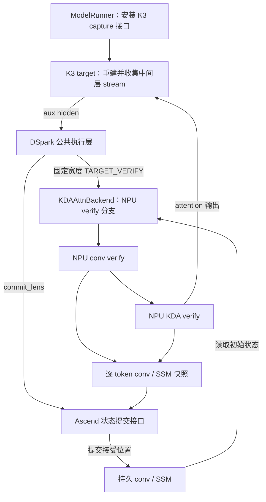
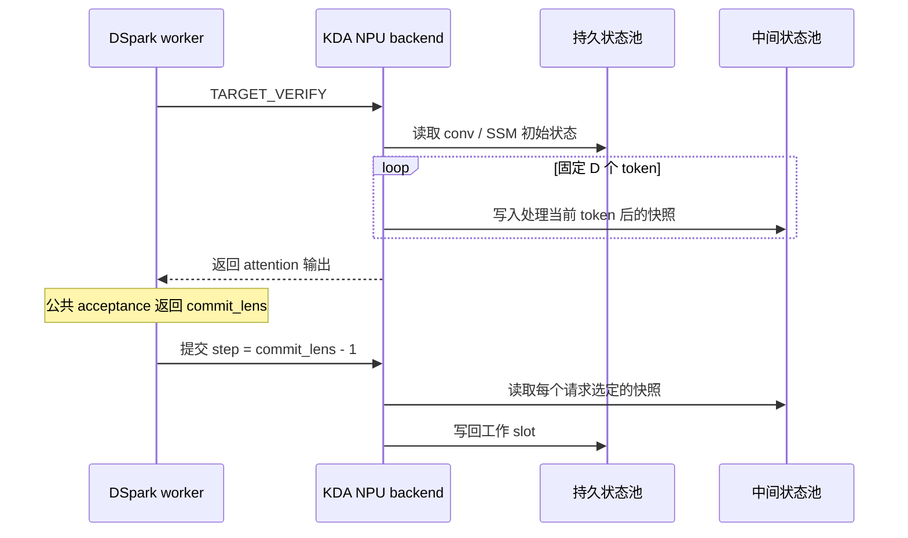

# Kimi K3 DSpark 投机推理的 Ascend NPU 适配设计

## 1 功能概述

本文描述 SGLang 在 Ascend NPU 上运行 Kimi K3 DSpark 投机推理的适配设计，依据已有代码说明模块划分、接口约定、数据布局、执行顺序和实现约束。

适配需要解决三个核心问题：

1. 将 K3 attention residual 表示转换为 draft 所需的 target 中间层特征，并保持并行分片后的 token 行对应关系。
2. 在 NPU 上执行 KDA 多 token 验证，为每个可能接受的位置保留卷积窗口与 SSM 状态，并按接受边界提交。
3. 使 Ascend attention、KV 写入、图执行和采样接口满足 K3 target 与 dense draft 的不同运行要求。

公共模块只描述因本适配增加或修改的接口与行为。DSpark 通用 proposal、Markov/confidence head、acceptance 算法、SPS/STS、完整调度流程，以及 K3 视觉编码、聊天模板、一般量化和常规 MoE 实现不在本文范围内。

下文“设计要求”表示接口应满足的语义，“当前实现”表示该基线中的调用行为。尚未满足或未经运行验证的部分集中列在第 7.2 节。

### 1.1 代码基线与来源

以 [hanwlax/sglang 的 0729_dspark](https://github.com/hanwlax/sglang/tree/f3dc7caf6168d581c0f5fcb36a37f331ac8a4872) 为代码基线，固定快照 `f3dc7caf6168d581c0f5fcb36a37f331ac8a4872`，比较基点为 `66034bff8bdf4613d02ddd270f19f5f29bd1e020`，核对日期为 2026-09-14。GitHub 分支头与本地 `mine/0729_dspark` 一致。

以 hanwlax 编写或提交的 DSpark/NPU 改动为主体；为解释分支实际行为，同时列出必要的协作修正，并标明作者和提交者。`userName` 为 Git 元数据原值，不推断其真实身份。启动脚本中的机器地址和调试配置不作为产品接口。

本文中的 SR 编号是本地需求追踪编号，DPR 从性能、资源、可靠性、兼容性和可验证性分析设计约束；它们不代表已分配的外部需求系统编号，也不表示相关验收已经通过。

| 设计主题 | Commit | 作者 | 提交者 | 归属说明 |
| --- | --- | --- | --- | --- |
| K3 DSpark 基础入口 | [8b1b235ab4](https://github.com/hanwlax/sglang/commit/8b1b235ab43f96fec4d8eb3f1fafd889472e3861) | hanwlax | hanwlax | hanwlax 实现 |
| Conv 快照提交与图接入 | [6c515b0eea](https://github.com/hanwlax/sglang/commit/6c515b0eea73109776026f3fedebf8fa33c6901c) | hanwlax | hanwlax | hanwlax 实现 |
| Draft graph replay 早期接入 | [0973304dd9](https://github.com/hanwlax/sglang/commit/0973304dd9e729c6a75843c01edfbc7e84120474) | hanwlax | hanwlax | hanwlax 实现 |
| NPU 验证和状态提交算子 | [7d0eb63aca](https://github.com/hanwlax/sglang/commit/7d0eb63aca9727db9836b31513bd5253c54421c2) | hanwlax | hanwlax | hanwlax 实现 |
| Attention residual 特征采集 | [b00a37531c](https://github.com/hanwlax/sglang/commit/b00a37531c83ca21730763c933a2663bf363c245) | hanwlax | hanwlax | hanwlax 实现 |
| Hidden/residual gather | [73eb0888db](https://github.com/hanwlax/sglang/commit/73eb0888db431744a270bd480e79a30c970c23cc) | hanwlax | hanwlax | hanwlax 实现 |
| 通信与归一化顺序 | [e412661373](https://github.com/hanwlax/sglang/commit/e412661373334d318399e7a8595a31fabe841ab2) | tian-shengzhao | hanwlax | 协作实现，hanwlax 提交 |
| 共享专家通信与图更新设备上下文 | [8ebf0dc34d](https://github.com/hanwlax/sglang/commit/8ebf0dc34d668f0cc8ed26796e07cfce7072e34c) | hanwlax | hanwlax | hanwlax 实现 |
| 有效 KV 前缀写入 | [9fd3ce3542](https://github.com/hanwlax/sglang/commit/9fd3ce3542633386451b9068412759483277ed7e) | hanwlax | hanwlax | hanwlax 实现 |
| scatter 发射规模 | [a3890a3539](https://github.com/hanwlax/sglang/commit/a3890a3539d57e3c9e5fabe935e643ffdafd00a4) | zhang-chunli01 | zhang-chunli01 | 分支协作修正 |
| SSM 目标 stride 与布局测试 | [f0831b259d](https://github.com/hanwlax/sglang/commit/f0831b259dae710c178329779eacaed88efa4d57) | zhang-chunli01 | zhang-chunli01 | 分支协作修正 |
| 非 DSpark 前向分流 | [0809d9b972](https://github.com/hanwlax/sglang/commit/0809d9b972714d9b7d5dfd4f8312cb346767b68b) | zhang-chunli01 | zhang-chunli01 | 分支协作修正 |
| Dense draft DP 本地图执行 | [2a2f2dd150](https://github.com/hanwlax/sglang/commit/2a2f2dd150e39454a3d9be7d244fbe25219bc88f) | userName | userName | 分支集成依赖，作者为占位名 |
| NPU top-k/top-p 接口兼容 | [3675e2a708](https://github.com/hanwlax/sglang/commit/3675e2a7086f26dea1601b99d388655ccc893fda) | userName | userName | 分支集成依赖，作者为占位名 |
| K3 TP 布局修正 | [bb9a3f24bd](https://github.com/hanwlax/sglang/commit/bb9a3f24bd79895d8c0db0458b698a93e4dc38fc) | userName | userName | 分支集成依赖，作者为占位名 |
| Gate 下界传递 | [f3dc7caf61](https://github.com/hanwlax/sglang/commit/f3dc7caf6168d581c0f5fcb36a37f331ac8a4872) | userName | hanwlax | 作者为占位名，hanwlax 提交 |

## 2 SR设计

| SR | 需求 | 设计约束 | 验收判据 |
| --- | --- | --- | --- |
| D-SR-01 | 向 dense draft 提供 target 特征 | 采集训练定义对应的 pre-norm residual stream；TP gather 保持行序 | 指定 tap 与下一阶段输入的参考表示一致 |
| D-SR-02 | NPU 执行 KDA 多 token verify | 读取已提交状态，保存每步 conv/SSM；gate 不重复激活 | 输出和全部状态符合逐步参考 |
| D-SR-03 | 按接受长度推进状态 | 工作槽提交 c-1；tracking 应提交 crossing step | conv/SSM/KV 前缀一致，可继续下一轮 |
| D-SR-04 | 适配 target 与 dense draft 的 attention/KV | target 宽 D，draft 宽 γ；metadata 与 FIA 长度来源一致 | 页边界、padding 和部分接受不越界 |
| D-SR-05 | NPU graph 与 DP 本地 draft 执行 | 正确并行域、设备上下文及固定捕获宽度 | eager/graph 有效行及接受后状态一致 |
| D-SR-06 | 提供可执行的 NPU 采样接口 | 能力检查后选择 NPU renorm 或 Torch 路径 | 归一化及边界参数符合接口语义 |

这些需求限定为 K3 DSpark 的 NPU 适配，通用候选生成和接受算法沿用公共实现。D-SR-03 的额外 tracking SSM 存在分支缺口，不能按完整支持验收。

## 3 实现思路



图中的 DSpark 公共执行层仅表示适配接口的调用方，内部候选生成和接受判定不展开。

适配相关的调用顺序为：

1. 初始化时，公共 runner 解析 target layer IDs，安装 K3 capture 接口；NPU 状态池分配持久状态与 speculative scratch。
2. K3 前向在指定层采集有效 residual stream，并将特征交给既有 DSpark 接口。
3. 每轮 target verify 前，worker 刷新 Mamba tracking 信息，清除残留的 extend tracking mask。
4. KDA 的 NPU verify 分支生成注意力输出及逐 token 状态快照。
5. 公共 acceptance 返回 `commit_lens` 后，worker 将线性接受位置交给 Ascend backend，提交对应 conv/SSM 状态。

### 3.1 核心数据约定

#### 3.1.1 长度与索引

| 符号 / 字段 | 定义 |
| --- | --- |
| `B` | 当前前向的请求数，捕获图时可包含 padding 请求 |
| `γ` | 每请求生成的候选 token 数，也是 dense draft 的每请求前向宽度 |
| `D = γ + 1` | Target 固定验证宽度；验证输入为 `anchor + γ 个候选` |
| `N = B × D` | 固定宽度 target verify 的 token 行数 |
| `c[r] = commit_lens[r]` | 请求 `r` 本轮推进的长度；正常活跃请求为 `1..D` |
| `step[r] = c[r] - 1` | 线性验证链上需要提交的快照下标，采用零基下标 |
| 持久 slot | 请求已接受状态所在的位置，由请求到 Mamba cache 的映射确定 |
| Scratch slot | 本轮验证的中间状态位置，与持久 slot 编号独立 |

例如 `γ=7、c=3` 时，提交快照下标 2，即处理完 anchor 和前两个候选后的状态。新采样的 bonus 是下一轮输入，本轮没有它的输入状态快照。

#### 3.1.2 一致性要求

| 对象 | 必须保持的关系 |
| --- | --- |
| Target 特征 | Tap 位置、层顺序及 pre-norm 语义与 draft checkpoint 的训练定义一致 |
| Token 行 | Aux hidden、position 和 cache location 使用相同的 token 顺序 |
| Gate | NPU verify 消费 K3 已激活的 gate 时，不再次执行 gate 激活 |
| 状态生命周期 | NPU verify 读取持久 conv/SSM，写入中间快照；接受结果确定后才提交持久状态 |
| 提交边界 | Conv、SSM 与实际接受前缀使用同一个 `step=c-1` |
| 内存访问 | 状态拷贝按实际 stride 寻址，不能用 shape 相等代替布局一致 |
| Attention metadata | Block table 覆盖范围与 FIA 使用的序列长度来源一致 |

## 4 实现设计

### 4.1 K3 特征采集与并行处理

#### 4.1.1 模型接口接入

K3 外层为 `KimiK3ForConditionalGeneration`，DSpark 使用其中的文本模型。包装层透传 `set_dspark_layers_to_capture()`、`lm_head`、`get_input_embeddings()` 与层范围属性，使公共 runner/worker 通过统一接口访问 K3。

`ModelRunner` 读取 draft 配置选择 target layer IDs；DSpark 显式配置的层号覆盖公共默认选择。模型支持 `set_dspark_layers_to_capture()` 时，优先调用该接口。

K3 setter 打开 `capture_aux_hidden_states` 并保存层号列表，要求 `PP=1`，拒绝 `None`。`KimiLinearModel.forward()` 在选中层执行完后保存特征，返回 `(hidden_states, aux_hidden_states)`；文本模型外层将该结果传给既有 logits processor。

采集接口的输出是按模型执行顺序排列的特征列表，每个 tap 对应该 token 批次的隐藏状态。当前 setter 不完整校验层号范围、重复和顺序；配置应使用有效、无重复、递增且与 draft 训练一致的层号。

#### 4.1.2 Attention residual 的采集语义

K3 层内的 `hidden_states` 不一定是下一阶段消费的完整 stream。`_dspark_capture_stream()` 负责还原第 `i` 层之后的 pre-norm residual stream。

| 模型状态 | 采集结果 |
| --- | --- |
| 未启用 attention residual，且 residual 为空 | `hidden_states` |
| 未启用 attention residual，且 residual 非空 | `hidden_states + residual` |
| 启用 attention residual，且还有下一层 | 使用下一层的 `self_attention_res_proj/norm` 执行 `apply_attn_res()` |
| 启用 attention residual，且为末层 | 使用模型的 `output_attn_res_proj/norm` 执行 `apply_attn_res()` |

Residual 混合中的 norm 用于计算混合 stream；输出仍是后续阶段归一化之前的特征。不能用模型最终 RMSNorm 后的隐藏状态替代该 tap。

#### 4.1.3 分片与归一化顺序

K3 attention-residual 路径需要先完成 attention 输出通信，再执行自身的 residual 累加、混合和归一化。公共 `LayerCommunicator.prepare_mlp()` 因此增加 `skip_layernorm` 参数；对应 reduce-scatter 实现允许 `residual=None`，并在该参数为真时跳过自动 layernorm。K3 在该路径传入 `skip_layernorm=True`。

该行为目前在对应 scatter 分支中实现，不能假设所有 communicator 分支均支持跳过归一化。

采集后，若启用 DP attention 且 `attn_tp_size>1`，K3 在 attention-TP 组内 gather aux hidden。Gather 前校验：

```text
本 rank 的采集行数 × attn_tp_size = forward_batch.input_ids 的行数
```

每个 tap 使用独立输出张量保存 gather 结果，确保后续层执行不会覆盖已采集的特征。

### 4.2 NPU KDA 多 token 验证

#### 4.2.1 模式分流与输入整理

`KDAAttnBackend` 保存 `_dspark_target_verify = spec_algorithm.is_dspark()`。只有该标志为真且模式为 `TARGET_VERIFY`，`forward_extend()` 才进入 `_forward_dspark_target_verify()`。

`KDAKernelDispatcher` 使用独立的 `verify_kernel`，与 decode/prefill kernel 选择分离。当前由 `TritonKDAKernel.target_verify()` 在 NPU 上分派到 `kda_target_verify_npu()`。

固定宽度输入按以下布局转换：

```text
mixed_qkv [B×D, C]
  → [B, D, C]
  → [B, C, D]：卷积输入
  → [B×D, C]：卷积输出
  → 按 q_dim / k_dim / v_dim 拆分
  → Q/K/V [1, B×D, heads, head_dim]
```

该分支要求存在 `intermediate_ssm`；缺少 speculative scratch 时直接报错。

公共入口还包含依据 `query_start_loc` 将 token scatter 到固定卷积窗口、再 gather 回原行顺序的代码，并使用额外无效行承接 padding。这只处理卷积输入布局。NPU SSM kernel 本身仍按 `batch_id × cache_steps + step` 划分请求，任意不等宽输入的限制见第 7.2 节。

#### 4.2.2 卷积验证接口

当前 NPU 调用为 `causal_conv1d_linear_verify_npu(..., update_persistent_state=False)`。

| 参数 / 结果 | 布局或语义 |
| --- | --- |
| `x` | `[B,C,D]`，待验证的原始 QKV 输入 |
| `conv_state` | `[pool,C,W]`，持久卷积历史 |
| `weight` | `[C,W+1]`，卷积权重 |
| `conv_state_indices` | `[B]`，各请求的持久 slot |
| `intermediate_state_indices` | `[B]`，各请求的 scratch slot |
| `intermediate_conv_window` | `[scratch,D,C,W]`，每个 token 之后的历史窗口 |
| 返回值 | `[B,C,D]`，卷积及激活后的输出 |

Kernel 在请求和通道块上并行，沿固定步数依次执行卷积、SiLU 和窗口推进。快照保存的是更新后的原始输入窗口，不能保存为激活后的输出。验证阶段保持持久窗口不变。

每步保存快照使提交能够选择任意已接受位置。仅保留最终窗口再做位移回滚，在 `D>W` 时无法恢复已被覆盖的早期历史。

接口要求卷积核宽度为 `2..6`，数据张量连续，输入与状态 dtype 一致；权重可使用独立 dtype。通道块最大为 256，以控制 Ascend 片上临时存储。

#### 4.2.3 SSM 验证接口与 GQA

`kda_target_verify_npu()` 以持久 SSM 为只读输入，逐 token 更新临时状态，同时写出 attention output 和中间状态。

| 参数 / 结果 | 布局 |
| --- | --- |
| Q / K / V | `[1,N,H_q,K]` / `[1,N,H_k,K]` / `[1,N,H_v,V]` |
| 预激活 `a` / `b` | K3 路径传入 `[1,N,H_k,K]` / `[1,N,H_v]` |
| 持久 SSM | `[pool,H_v,V,K]` |
| 中间 SSM | `[scratch,D,H_v,V,K]` |
| 返回值 | `[1,N,H_v,V]` |

Wrapper 将 Q/K/V 和 gate 的只读视图转为连续布局，持久状态与快照使用真实 stride 寻址。`H_v` 必须分别被 `H_q`、`H_k` 整除；kernel 分别按 `H_v/H_q`、`H_v/H_k` 映射 head，不假定 Q、K 的 head 数相同。

Kernel 沿请求、value head 和 V 维块并行，固定循环处理 `D` 个 token。K 维使用不超过 256 的块，V 维块最大为 64。步数来自张量形状和 `cache_steps`，不依赖读取 device scalar 来驱动逐请求 Python 循环。

#### 4.2.4 Gate 预激活与下界传递

K3 的非 decode 路径已通过 `fused_kda_gate()` 计算 log-decay，并对 beta 执行 sigmoid。NPU wrapper 根据 `a/b` 成对前置 singleton 维，或显式 `gates_are_preactivated` 参数，选择预激活模式。该模式下 kernel 使用 `exp(a)` 与已有 beta，避免重复激活。

当前 K3 还读取 `linear_attn_config.gate_lower_bound` 并传入公共 gate 接口。Gate 计算规则为：

```text
未配置 lower_bound：log_decay = -exp(A_log) × softplus(raw_gate + dt_bias)
配置 lower_bound：  log_decay = lower_bound × sigmoid(exp(A_log) × (raw_gate + dt_bias))
```

NPU verify 消费已经包含下界语义的 gate，无需在 SSM kernel 中再次计算。普通 decode 与 target verify 应使用一致的模型参数和衰减定义，需要在数值验证中对齐。

### 4.3 状态池与接受边界提交

#### 4.3.1 NPU 状态布局

KDA 配置中的 conv shape 为 `(window,channels)`。公共 memory pool 向 `_init_npu_conv_state()` 传递 `is_kda`，NPU 实际分配为 `(channels,window)`，并保持 KDA 持久窗口长度固定；投机长度只增加快照容量。

| 状态 | 逻辑布局 | 生命周期 |
| --- | --- | --- |
| 持久 conv | `[L,P,C,W]` | 保存当前已接受历史 |
| 中间 conv | `[L,R,D,C,W]` | 本轮各验证位置后的窗口 |
| 持久 SSM | `[L,P,H_v,V,K]` | 保存当前已接受的递归状态，可能为转置视图 |
| 中间 SSM | `[L,R,D,H_v,V,K]` | 本轮各验证位置后的递归状态 |

`L` 为 KDA 层数，`P/R` 为持久/中间池容量，容量包含相应保留 slot。NPU speculative 分配对 temporal state 最后两轴做转置；即使 `K=V`、shape 不变，实际 stride 也可能不同。

由上述 dense 快照布局可得，中间池的数据量约为：

```text
L × R × D × (C × W × conv元素字节数 + H_v × V × K × SSM元素字节数)
```

该式不含分配器开销。逐步快照以额外容量和写带宽换取任意接受边界的直接提交能力。

#### 4.3.2 状态提交顺序

公共 worker 在 verify 前调用 `prepare_mamba_track_for_verify()`，重建 tracking 索引并清除 extend 阶段遗留的 tracking mask。Acceptance 确定后构造线性 `chain_accept_index`，调用 `commit_mamba_states_after_verify()`，将提交位置归约为 `c-1`。



Ascend backend 使用当前请求的 Mamba cache 索引作为目标 slot，以请求行号构造当前提交调用的 scratch 来源。

- SSM：调用 `move_intermediate_cache()`，按真实目标 stride 分块拷贝选定快照。
- Conv：当 `_dspark_target_verify` 为真时，调用 `speculative_state_scatter_npu()` 从逐步窗口直接提交，跳过旧的窗口位移 rollback。
- Snapshot scatter：支持状态尾维 stride，负索引屏蔽相应请求；当前用固定 48 个 program 遍历逻辑任务，避免直接展开过大的 launch grid。

#### 4.3.3 Prefix-cache tracking

若接受前缀跨过 tracking interval，tracking slot 应保存该边界的状态。其 step 可能早于本轮末接受 step，因此 conv 和 SSM 都必须读取 crossing step 的快照。

公共 helper 已计算 `mamba_steps_to_track`，Ascend conv 分支也使用 tracking slot/step。当前 SSM tracking 调用仍使用工作 slot 和末接受 step，尚未符合上述要求；具体缺口见第 7.2 节。

### 4.4 Ascend Attention metadata 与 KV 写入

#### 4.4.1 Target / draft 验证宽度

公共图前向模式在 target 与 dense draft 间复用，但二者输入宽度不同。`AscendAttnBackend` 初始化时，对 draft worker 调用算法的宽度解析接口，得到 `γ=D-1`；target 保持 `D`。这样 mask 和 metadata 使用本 worker 的实际前向宽度。

#### 4.4.2 序列长度来源

Overlap 执行中，CPU 和 device 序列长度可能对应不同推进时刻。FIA 使用 CPU 长度，因此 target verify 的 block table 覆盖范围改为：

```text
seq_lens_cpu.max() + 当前 worker 的验证宽度
```

该调整使 block table 与 FIA 的长度来源一致，避免页边界附近因混用长度造成 KV 覆盖不足。它位于 metadata 初始化路径，不应与 kernel 内部的固定步循环混为同一执行阶段。

#### 4.4.3 FIA KV scatter 与有效前缀写入

`NPUMHATokenToKVPool.set_kv_buffer()` 在 FIA 模式把 `[slot,1,heads,dim]` 存储视为 `[slot,heads,dim]`，再调用 `npu_scatter_nd_update_`。该视图保留底层存储，适配 CANN scatter 的维度要求；调用前检查 KV 行数与 location 数一致。

`set_kv_buffer_prefix_valid()` 增加 NPU Triton 写入路径。其接口使用：

| 输入 | 约定 |
| --- | --- |
| 目标 K/V | Slot-major 的 `[slots,heads,dim]` 视图 |
| 源 K/V | `[rows,heads,dim]`，行数等于 `loc_2d.numel()` |
| `loc_2d` | `[B,width]`，各请求的写入地址 |
| `commit_lens` | `[B]`，各请求的有效前缀长度 |

Kernel 在 device 侧判断 `row_in_batch < commit_lens[batch]`，只写有效行，不先构造动态长度的有效行列表。K/V 的 head 与 head-dim 轴必须连续，源目标 dtype 和设备必须符合接口检查。该路径由 NPU pool 的配置选择，关闭时调用父类实现。

本节只描述设备写入适配；hidden 到 draft KV 的公共投影与注入算法不展开。

### 4.5 NPU Graph 与并行域

Dense draft 在 DP attention 场景通过 `draft_tp_context(attn_tp_group)` 使用 attention-TP 组，按本 DP rank 的批次执行。公共 graph runner 使用 `is_dp_local_cuda_graph_capture()` 统一 capture batch 对齐和 replay batch 选择，并排除该类 draft 对跨 DP MLP gather 的依赖。

虽然公共接口名带有 `cuda_graph`，此处描述的是 NPU graph runner 使用该公共执行路径时的适配。Target 保留其混合模型的并行和 padding 要求。

`NPUCudaGraphBackend` 记录创建时的 device ID，在新线程执行 `graph.update()` 前恢复设备上下文，使更新线程使用正确设备。

图路径需要保持以下约定：

- Target 和 draft 分别按 `D`、`γ` 解释 token 行数。
- Dense draft 使用与其执行域一致的本地 batch。
- 验证 kernel 的循环长度由固定输入形状决定。
- 图命中与 eager 回退都必须得到相同的有效输出、快照和 metadata 语义。

源码中的早期 Torch verify helper 未被当前 NPU 主入口选用；不能将其行为当作图路径失败后的自动回退策略。

### 4.6 NPU 采样兼容

NPU 分支中，来自其他设备实现的 `top_p_renorm_prob`、`top_k_renorm_prob` 可能为空。公共 verify 概率构造入口改为调用 wrapper，由 wrapper 选择可执行的设备路径。

| 条件 | 调用路径 |
| --- | --- |
| 已有专用 renorm kernel 可用 | 调用该 kernel |
| Tensor 位于 NPU、存在 `torch_npu.npu_top_k_top_p`，且参数满足检查 | 调用 NPU 实现 |
| NPU 分派条件不满足 | Top-k 使用 Torch 回退；top-p 使用 `top_p_normalize_probs_torch()` |

NPU wrapper 将概率取 log 后交给 `npu_top_k_top_p`，并对输出执行 softmax。Top-p 参数转换为概率 tensor 的设备和 dtype；top-k 参数转换为 int32，并检查 `1..1024` 范围。

对应 sampling 功能开启时，公共入口才调用这些 wrapper。分派条件不满足会进入 Torch 回退；当前实现不把 NPU 算子运行时异常作为自动回退条件。Top-k 路径仍包含 `.item()`，因此这里不能按完全无主机同步的图内路径处理。

本节仅说明新增的设备分派、输入转换和回退接口，不描述通用采样与 acceptance 算法。

## 5 实现接口设计

所有新增接口均位于进程内，复用既有生成服务协议。以下表格明确跨模块交接；算子的完整形状、stride 和负索引契约见 [DSpark NPU 算子设计第 5 章](dspark_ascend_npu_kernels_design.md#5-实现接口设计)。

| 接口 / 交接 | 调用方 → 实现方 | 输入与输出 | 必须满足的契约 |
| --- | --- | --- | --- |
| `set_dspark_layers_to_capture(layer_ids)` | ModelRunner → K3 包装层 / 文本模型 | 配置 target tap 层号 | PP=1；非空配置、范围和顺序由集成方保证 |
| `_dspark_capture_stream()` | K3 前向 → residual 重建 | 层输出及 residual → pre-norm stream | 与 checkpoint 定义一致，按模型执行顺序采集 |
| `prepare_mlp(..., skip_layernorm=True)` | K3 residual 路径 → LayerCommunicator | hidden/residual → 通信后的张量 | 仅在支持该行为的分支跳过自动 layernorm |
| `prepare_mamba_track_for_verify()` | DSpark worker → tracking helper | 当前请求与状态映射 → 本轮 tracking 信息 | verify 前刷新索引并清除旧 extend mask |
| KDA `target_verify()` | KDA backend → NPU dispatcher | 固定 D 个 token、gate、状态池 → 输出及逐步快照 | 两类持久状态只读；提交独立发生 |
| `commit_mamba_states_after_verify()` | DSpark worker → Ascend backend | 接受长度和线性接受索引 → conv/SSM 提交 | 工作 step=c-1，tracking 使用 crossing step（SSM 仍待修正） |
| `set_kv_buffer_prefix_valid()` | draft hidden KV 注入 → NPU MHA pool | K/V、`loc_2d[B,width]`、`commit_lens[B]` → 原地缓存写入 | 宽度来自当前输入；有效槽不冲突 |
| `draft_tp_context(attn_tp_group)` | draft worker → 并行上下文 | attention-TP 组 → DP 本地 draft 执行域 | capture 和 replay 使用一致的本地 batch |
| NPU top-k/top-p wrapper | verify 概率构造 → 设备采样实现 | 概率、top-k/top-p → 重归一化概率 | 能力不满足走 Torch；运行时异常不自动回退 |

状态池拥有持久状态和 scratch 存储；worker 拥有本轮请求映射和接受长度；模型负责特征及 gate 语义；backend 负责 metadata、设备分派和提交。持久状态、scratch 和 KV 的存储地址不作为外部服务协议暴露。

### 5.1 模块定位

所有路径均相对固定基线的仓库根目录：

| 责任 | 模块 |
| --- | --- |
| K3 包装与特征采集 | `python/sglang/srt/models/kimi_k3.py`、`python/sglang/srt/models/kimi_linear.py` |
| KDA verify 分流 | `python/sglang/srt/layers/attention/linear/kda_backend.py`、`linear/kernels/kda_triton.py`（同 attention 目录下） |
| NPU 状态提交 | `python/sglang/srt/hardware_backend/npu/attention/ascend_hybrid_linear_attn_backend.py` |
| NPU KV 写入 | `python/sglang/srt/hardware_backend/npu/memory_pool_npu.py` |
| 公共接口调用方 | ModelRunner、DSpark worker、LayerCommunicator、公共 graph runner；仅本文所述适配行为属于本设计 |

## 6 安全配置设计

本设计不增加网络监听、身份认证、密钥或用户权限接口，沿用 SGLang 服务的部署边界。这里的安全配置重点是模型配置可信、请求状态隔离、设备内存访问有效和执行依赖完整。

仅从可信来源加载模型、draft 配置和算子库，并固定模型与软件版本；不把开发启动脚本中的远端地址、日志路径或临时绕过检查设置作为推荐配置。模型特征、KV、概率和状态快照属于请求数据，常态日志不输出其完整内容；调试产物按既有访问权限和保留策略管理。上述是部署要求，本文引用的提交未新增对应的认证或日志脱敏实现。

### 6.1 功能和并行配置

| 配置 / 条件 | 设计要求 | 当前实现边界 |
| --- | --- | --- |
| DSpark 与 draft checkpoint | 算法、target tap、验证宽度和训练定义一致 | 配置成功不等于特征语义已验证 |
| PP / DP attention | K3 capture 要求 PP=1；DP attention 要启用 DP lm head，且 attn_cp_size≤1 | 不支持的组合不能作为已支持部署 |
| `SGLANG_NPU_USE_TRITON_PREFIX_KV_CACHE_STORE` | 默认 False；旧名 `SGLANG_NPU_USE_TRITON_KV_CACHE_STORE` 为兼容别名 | 初始化时选路；关闭走父类 KV 写入，不关闭 DSpark |
| KDA 输入和状态容量 | 固定宽度 D；conv 核宽 2–6；K≤256；GQA 整除 | 正索引上界与写槽唯一性仍由上层保证 |
| Capture layer IDs | 有效、无重复、递增并与 draft 匹配 | setter 尚无完整范围/顺序校验 |
| NPU graph | 固定 device、宽度和并行域；图更新线程恢复 device | 无自动切换到早期 Torch verify helper 的保证 |

### 6.2 请求隔离与失败处理

不同请求必须分配不冲突的持久槽和 scratch 槽；接受结果、conv/SSM 状态和 KV 前缀必须属于同一轮输入。Verify 完成之前不读取快照，提交完成之前不复用快照；跨流调用需明确事件依赖。SSM move 只屏蔽负 step，不能把负源/目标槽与有效 step 一起传入。

异常发生后不得将部分写回状态继续当作完整已提交版本。恢复应从一致状态重新建立请求上下文；本分支未提供跨状态池的事务恢复。额外 prefix-cache tracking 在第 7.2 节问题修正及回归通过前，不声明其 SSM 与 conv 一致性已得到保证。

## 7 DPR分析

| 维度 | 设计分析 | 验收要求 |
| --- | --- | --- |
| 性能 | 多 token verify 减少主机逐步调度，增加 scratch 写入；TP gather 与采样同步也有成本 | 分别测量特征采集、verify、commit、draft 和端到端时延 |
| 资源 | 第 4.3 节公式计算中间池；容量随 L/R/D 及状态维度增长 | 核算 target/draft 权重、KV、scratch、图缓冲的总峰值 |
| 可靠性 | 状态版本、gate 语义和请求行序共同决定后续生成正确性 | 逐步参考、跨轮续算、padding 和跨页验证 |
| 兼容性 | 仅固定线性验证链；图和 DP 域需匹配；采样有同步及回退边界 | 各模式分别准入，不从单一算子测试推导整模型支持 |
| 可维护性 | 模型 / worker / backend / kernel 分工，五个主路径算子单独定义契约 | 保留来源 commit，协作修正与待办可追溯 |

### 7.1 验证方案

#### 7.1.1 算子与接口验证

| 验证对象 | 检查方法与断言 | 已有用例情况 |
| --- | --- | --- |
| K3 tap | 与下一阶段消费的 pre-norm stream 对比；覆盖末层、attention residual 和 TP gather 的行顺序 | 需补充模型级测试 |
| NPU conv verify | 对比逐 token reference 的输出和每步窗口；verify 前后持久状态不变；覆盖 `D>W`、非整块通道与混合权重 dtype | 不计入本基线覆盖，需补充独立验证 |
| NPU SSM verify | 对比 attention 输出和全部 step snapshot；检查持久状态不变、GQA、预激活 gate、`K≠V` 及 stride | 不计入本基线覆盖，需补充独立验证 |
| Snapshot 提交 | 对 `c=1`、中途拒绝、`c=D` 检查目标状态等于 `scratch[c-1]`，其他 slot 不变 | 分支内 SSM move 用例；scatter 独立用例待补 |
| Verify metadata | 检查 eager/graph 初始化选择；集成测试进一步覆盖 target/draft 宽度和页边界 | 需补充独立 metadata 用例 |
| NPU sampling | 检查 kernel 缺失时回退；进一步对比 NPU 分派与 Torch 路径的概率、归一化和边界参数 | `test/registered/unit/speculative/test_dflash_utils.py` |

独立 conv/KDA、scatter 和 metadata 的工作区补充用例不属于指定分支提交，不能作为本基线已交付覆盖。分支内 SSM move 用例覆盖目标转置布局；其余场景按上表补齐。

#### 7.1.2 模型级验证

在相同 target/draft checkpoint、并行配置和请求输入下，检查：

1. 普通 decode 与 target verify 的 gate 定义、输出及接受边界状态一致，覆盖启用 `gate_lower_bound` 的配置。
2. 单请求与多请求、不同接受长度、padding、跨页以及图命中/回退得到一致的有效状态。
3. Prefix-cache tracking 修正后，跨 interval 的 conv/SSM 均等于该边界 reference；缓存复用后的续写结果一致。
4. 性能比较固定权重、输入输出长度、并发度、采样参数和并行配置，分别测量 verify、状态提交及端到端时延；不以算子用例代替整模型性能结论。

Conv/KDA 验证、状态 scatter 和 verify metadata 的独立用例属于工作区补充测试，未包含在分支提交中；SSM move 用例与 sampling 单测已随源码提交。本文记录用例和验证要求，不声明这些测试已在当前基线执行通过。

### 7.2 约束与当前实现缺口

| 项目 | 当前行为及限制 |
| --- | --- |
| NPU 固定宽度 | KDA kernel 仅以 `cache_steps` 切分请求，不接收逐请求 offset。不等宽输入即使总行数可整除，也不能证明请求分界正确；需要独立的 ragged 转换或 kernel 支持。 |
| Prefix-cache SSM tracking | Ascend tracking 分支内第二次 `move_intermediate_cache()` 仍传入 `dst_indices_tensor/last_steps`，没有传入 `mamba_track_indices/mamba_steps_to_track`，未实现预期 tracking SSM 写入。 |
| Capture 配置 | Layer IDs 的范围、重复与顺序未在 K3 setter 中完整校验；实际采集顺序为模型执行顺序。 |
| 并行配置 | K3 capture 要求 `PP=1`；DSpark DP attention 要求启用 DP lm head，且该组合不支持 `attn_cp_size>1`。 |
| Kernel 形状 | NPU conv 核宽为 `2..6`；KDA 的 K 维不超过 256，并要求 value head 数分别被 Q/K head 数整除。 |
| Sampling 回退 | 能力检查与 Torch 回退中存在主机同步点，需独立评估 graph 适用性。 |

这些结论来自源码检查。本次只修改设计文档，没有修复上述实现缺口或执行 NPU 复现。

## 8 分配需求

| SR | 分配模块 / 责任域 | 交付与验收证据 | 状态 |
| --- | --- | --- | --- |
| D-SR-01 | K3 模型；ModelRunner；LayerCommunicator | tap 配置、residual 语义、TP 行序对照 | 已接入；完整 tap 校验与模型回归待补 |
| D-SR-02 | KDA backend / dispatcher；NPU 算子 | K-SR-01/02 的接口与数值验证 | 已接入；固定宽度限制保留 |
| D-SR-03 | DSpark worker；Ascend hybrid backend；状态池 | K-SR-03 工作提交与 crossing tracking 联合验证 | 工作提交已实现；tracking SSM 待修正 |
| D-SR-04 | Ascend attention backend；NPU KV pool | K-SR-04 有效前缀、target/draft 宽度与页边界 | 已接入；设备联合验证待执行 |
| D-SR-05 | draft worker；公共/NPU graph runner | K-SR-05 多轮 graph、DP 本地 batch、设备线程上下文 | 已接入；eager/graph 验收待执行 |
| D-SR-06 | 采样 wrapper；验证责任域 | NPU 能力分派、Torch 回退与概率边界 | 已有实现与部分单测；不承诺完全无主机同步 |

本表为模块责任分配。人员、工期、业务精度阈值和正式需求编号由项目管理确定；本文不将待执行验证写为已通过结果。950DT 后续优化见 [性能优化设计](kimi_k3_950dt_performance_design.md)。
